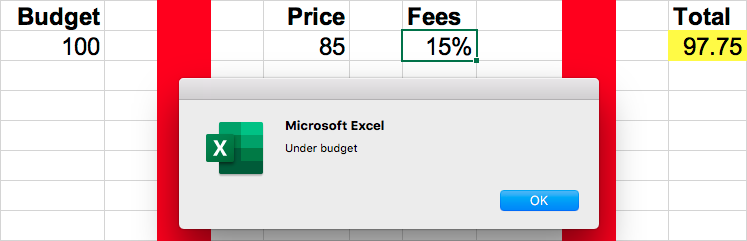
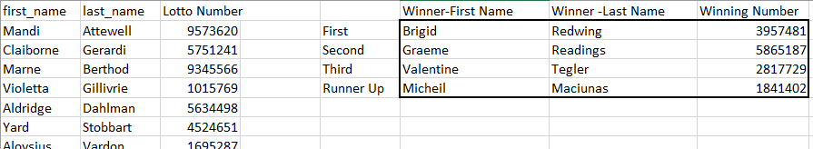
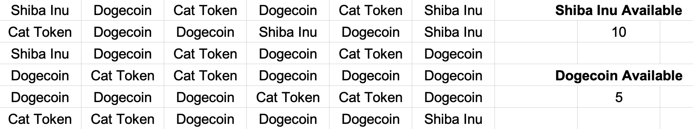
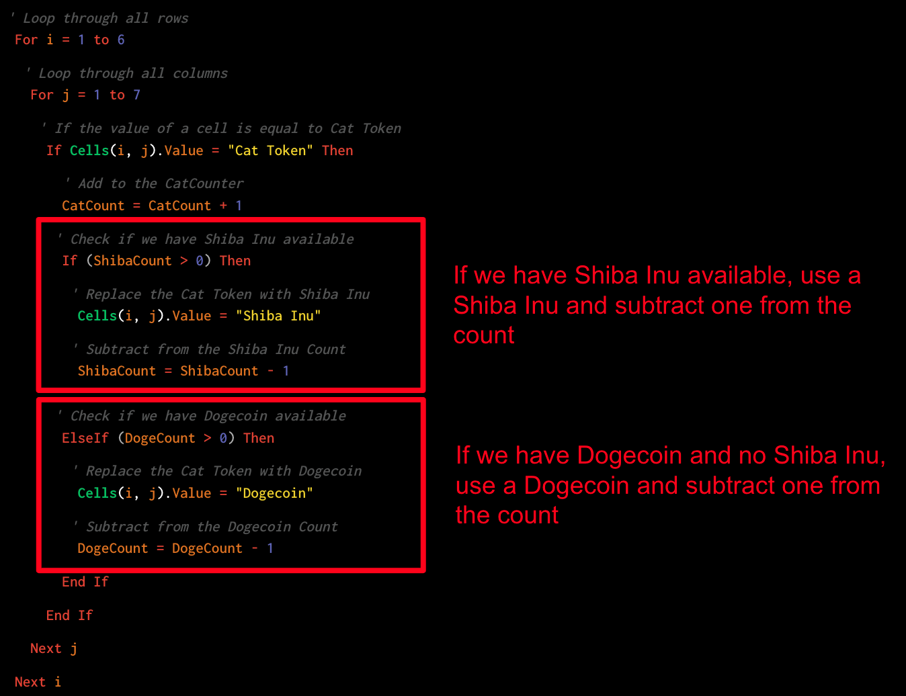
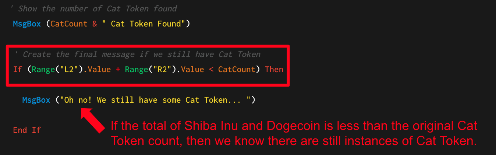

## 2.2 Control Flow with VBA

### Overview

In today's class, students will learn to use basic and nested `for` loops together with conditionals to perform common coding tasks in VBA.

### Class Objectives

By the end of this lesson, the students will be able to:

* Describe the basic syntax of a VBA `for` loop.
* Use `for` loops and conditionals to direct logic flow.
* Explain the value and basics of using nested `for` loops.
* Refine their fundamental coding skills: syntax recollection, pattern recognition, problem decomposition, and debugging.

---

### Instructor Notes

* Today is a fun but challenging class. Students will complete a series of programming challenges in VBA. As with many classes to come, today is an exercise-heavy lesson. The class should feel lively, as students may struggle through challenges and experience many "light bulb" moments. Do your part to facilitate this atmosphere, and encourage active dialogue within groups.

* Since today's class contains many exercises, your time behind the podium should feel minimal. Instead, regularly circulate the class, and bring your teaching to the students in their seats. This approach will help you tailor your teaching to the needs of specific students.

* As with the previous class, it is important to stress that today's exercises exemplify fundamental programming concepts across languages. At times, you may hear students express frustration with VBA. If so, help reframe their thinking. Tell them that their frustration is normal, as this lesson will have them tackle increasingly complex problems that combine multiple fundamental concepts.

---

### Class Slides

* The slides for this lesson can be viewed on Google Drive here: [Lesson 2.2 Slides](https://docs.google.com/presentation/d/1HpP3Hb3HnYJ4nldADC1SU2hbLGlgtiWsJa6iSP1NY-Q/edit?usp=sharing).

* To add the slides to the student-facing repository, download the slides as a PDF by navigating to File, selecting "Download as," and then choosing "PDF document." Then, add the PDF file to your class repository along with other necessary files. You can view instructions for this [here](https://docs.google.com/document/d/1XM90c4s9XjwZHjdUlwEMcv2iXcO_yRGx5p2iLZ3BGNI/edit).

* **Note:** Editing access is not available for this document. If you wish to modify the slides, create a copy by navigating to File and selecting "Make a copy...".

---

### Time Tracker

| Start Time | Number | Activity                                           | Duration |
| ---------- | ------ | -------------------------------------------------- | -------- |
| 6:30 PM    | 1      | Instructor Do: Welcome Students                    | 0:05     |
| 6:35 PM    | 2      | Partners Do: Warm-up Activity (Budget Checker)     | 0:15     |
| 6:50 PM    | 3      | Review: Warm-Up (Budget Checker)                   | 0:10     |
| 7:00 PM    | 4      | Instructor Do: For Loop                            | 0:10     |
| 7:10 PM    | 5      | Students Do: Chicken Nugget Loop                   | 0:10     |
| 7:20 PM    | 6      | Review: Chicken Nuggets Loop                       | 0:05     |
| 7:25 PM    | 7      | Instructor Do: Loop Conditionals                   | 0:10     |
| 7:35 PM    | 8      | Students Do: Fizz Buzz                             | 0:20     |
| 7:55 PM    | 9      | Review: Fizz Buzz                                  | 0:10     |
| 8:05 PM    | 10     | BREAK                                              | 0:15     |
| 8:20 PM    | 11     | Partners Do: Lotto Search                          | 0:20     |
| 8:40 PM    | 12     | Review: Lotto Search                               | 0:05     |
| 8:45 PM    | 13     | Instructor Do: Nested For Loops                    | 0:10     |
| 8:55 PM    | 14     | Students Do: Crypto Kennel                         | 0:25     |
| 9:20 PM    | 15     | Review: Crypto Kennel                              | 0:10     |
| 9:30 PM    |        | END                                                |          |

---

### 1. Instructor Do: Welcome Students (5 min)

Spend a few moments welcoming students. Let them know that in today's class, we'll be “ripping off the band-aid.” They'll spend the majority of class working on exercises designed to build their programming skills.

If you'd like, feel free to use the slideshow to kick off class with some warm-ups.

---

### 2. Partners Do: Warm-up Activity (Budget Checker) (15 min)

**Corresponding Activity:** [01-Stu_Warmup](Activities/01-Stu_Warmup)

Direct students to the warm-up activity. In this activity, students will work in pairs to create a script that calculates a total price, including fees, and then corrects the initial price if the total is over budget, as in the following image:



Demonstrate to students how the solved code should work, then have your TAs send out the unsolved file and the instructions:

**File:** [budget_checker.xlsm](Activities/01-Stu_Warmup/Unsolved/budget_checker.xlsm)

**Instructions:** [README.md](Activities/01-Stu_Warmup/README.md)

---

### 3. Review: Warm-Up (Budget Checker) (10 min)

**File:** [budget_checker_solution.vbs](Activities/01-Stu_Warmup/Solved/budget_checker_solution.vbs)

Once time is up, review the solution to the previous exercise. As you do so, encourage students to explain to you what is happening in the code.

While discussing Part 1, be sure to point out the following:

  * First, we created a variable called `total` (as a `double`) to hold our full cost.

  * Next, we combined the `price` and `(1 + tax)` to calculate the full cost.

  * Finally, we entered the final cost into the `total` cell.

  ```vb
  ' Part 1
  ' ----------------------------------------------------

  ' 1. Retrieve the Price and Fees from the cells
  Dim total As Double

  ' 2. Use these values to calculate the total
  total = Range("F3").Value * (1 + Range("H3").Value)
  ' MsgBox(total)

  ' 3. Enter the total into the appropriate cell
  Range("L3").Value = total
  ```

While discussing Part 2, be sure to point out the following:

  * First, we created a variable called `budget` to hold our budget amount.

  * We then compared the value of our budget against `total`.

  * If the budget was greater than the total, we displayed a message that we were under budget. If the budget was less than the total, the message stated that we were over budget.

  ```vb
  ' Part 2
  ' ----------------------------------------------------
  ' 4. Create a variable to store budget
  Dim budget As Double
  budget = Range("B3").Value
  ' msgbox(budget)

  ' 5. Compare using conditionals whether total is greater than or less than the budget
  If budget > total Then

      MsgBox ("Under budget")

  Else

      MsgBox ("Over budget")
  End If
  ```

While discussing Part 3, be sure to point out the following:

  * First, we had to use algebra to determine our formula for the new price. In this case, the new price was equal to `budget` divided by `(1 + tax)`.

  * We then stored the new price in a variable and used it with the tax to calculate the new total.

  * We rounded the new price down to the nearest whole dollar using a `WorksheetFunction`. This method allows users to access many of the functions available in Excel. `RoundDown(newPrice, 0)` stipulates that we're rounding down the `newPrice` variable and that we're not including any digits past the decimal.

  ```vb
  'Use a worksheet function to round the new price down to the nearest whole dollar
  newPrice = Application.WorksheetFunction.RoundDown(newPrice, 0)
  ```

  * Finally, we changed the price and the total in the appropriate cells.

  ```vb
  ' Part 3
  ' ----------------------------------------------------
  Dim newPrice As Double
  newPrice = budget / (1 + Range("H3").Value)

  ' Change the price
  Range("F3").Value = newPrice

  ' Change the new total
  Range("L3").Value = newPrice * (1 + Range("H3").Value)
  ```

Ask if there are any questions before providing students with the solution and proceeding to the next section.

---

### 4. Instructor Do: For Loop (10 min)

**Corresponding Activity:** [02-Ins_ForLoops](Activities/02-Ins_ForLoops)

**Files:**

  * [basic_for_loop_solution.vbs](Activities/02-Ins_ForLoops/Solved/basic_for_loop_solution.vbs)
  * [basic_for_loop_solution.xlsm](Activities/02-Ins_ForLoops/Solved/basic_for_loop_solution.xlsm)

Next, you'll be introducing `for` loops. Guide students through the code, and run the VBA script. This code simply inserts a series of numbers across rows and columns.

While explaining the code, be sure to note the parts of a VBA `for` loop:

  * `For i = 1 to 20` specifies the range to loop through.

  * Subsequent uses of `i` change with the loop.

  * `Next i` iterates to the next value of `i`.

  * **Note**: While semantic variable declaration is more prevalent, `i` is deliberately chosen here because it has been commonly used in programming for decades; it is also the default mathematical notation. Students will encounter iterators such as `i` and `j` both later in the course and when they land a job in the field.

During your discussion, spend a few moments having students guess how the spreadsheet will look once you run the code. In particular, challenge them to understand why `Cells(i, 1)` creates entries across rows and `Cells(1, i)` creates entries across columns.

```vb
' Create a variable to hold the counter
Dim i As Integer

' Loop through from numbers 1 through 20
For i = 1 To 20

    ' Iterate through the rows placing a value of 1 throughout
    Cells(i, 1).Value = 1

    ' Iterate through the columns placing a value of 5 throughout
    Cells(1, i).Value = 5

    ' Places increasing values based upon the variable "i" in B2 to B21
    Cells(i + 1, 2).Value = i + 1

' Call the next iteration
Next i
```

Once you feel confident in their understanding, provide them with your code.

---

### 5. Students Do: Chicken Nugget Loop (10 min)

**Corresponding Activity:** [03-Stu_ChickenNuggets-ForLoop](Activities/03-Stu_ChickenNuggets-ForLoop)

**Instructions:** [README.md](Activities/03-Stu_ChickenNuggets-ForLoop/README.md)

Proceed with the next student exercise. In this example, students will create a basic VBA script that prints "I will eat `i` Chicken Nuggets," where the value of `i` changes within the `for` loop.

Demonstrate to students what happens after the code runs, then send them the instructions.

---

### 6. Review: Chicken Nuggets Loop (5 min)

**Files:**

* [chicken_nuggets_solution.vbs](Activities/03-Stu_ChickenNuggets-ForLoop/Solved/chicken_nuggets_solution.vbs)

* [chicken_nuggets_soluton.xlsm](Activities/03-Stu_ChickenNuggets-ForLoop/Solved/chicken_nuggets_solution.xlsm)

Once the time is up, review the exercise with students, and be sure to cover the following points:

  * We created a `for` loop that iterates from 1 through 10.

  * We set the values of `(i, 1)` and `(i, 3)` to be fixed values of "I will eat " and "Chicken Nuggets".

  * We set the value of `(i, 2)` to be `i +10`. This forces the loop to print 11 through 20.

  * Finally, we use `Next i` to signal that we are done with the loop and on to the next one.

```vb
' Loop through first 10 rows
For i = 1 To 10

    ' Set values in column 1 to "I will eat"
    Cells(i, 1).Value = "I will eat "

    ' Set values in column 2 to the sum of the counter + 10
    Cells(i, 2).Value = i + 10

    ' Set values in column 3 to "Chicken Nuggets"
    Cells(i, 3).Value = "Chicken Nuggets"

' Call the next iteration
Next i
```

Ask if there are any questions before proceeding to the next example.

---

### 7. Instructor Do: Loop Conditionals (10 min)

**Corresponding Activity:** [04-Ins_LoopConditionals](Activities/04-Ins_LoopConditionals)

**Files:**

* [conditional_loops_solution.vbs](Activities/04-Ins_LoopConditionals/Solved/conditional_loops_solution.vbs)
* [conditional_loops_solution.xlsm](Activities/04-Ins_LoopConditionals/Solved/conditional_loops_solution.xlsm)
* [modulus_solution.vbs](Activities/04-Ins_LoopConditionals/Solved/modulus_solution.vbs)
* [modulus_solution.xlsm](Activities/04-Ins_LoopConditionals/Solved/modulus_solution.xlsm)

Next, introduce one of this week’s most important concepts: **looped conditionals**. As a proficient developer, you’ll find this concept simple and intuitive, but do not underestimate how difficult it can be for students.

Open [modulus_solution.vbs](Activities/04-Ins_LoopConditionals/Solved/modulus_solution.vbs), and explain that the modulus essentially performs long division on a number and returns the remainder. Note that in VBA, modulus is denoted by `Mod`. Run the code in [modulus_solution.xlsm](Activities/04-Ins_LoopConditionals/Solved/modulus_solution.xlsm).

Then, open [conditional_loops_solution.vbs](Activities/04-Ins_LoopConditionals/Solved/conditional_loops_solution.vbs), and guide students through the code. Have them guess what it will do before running the code.

Then, explain it line by line.

  * Start by pointing out the basic `for` loop structure.

  * Then, introduce the concept of the modulus to determine the remainder.

  * Point out that we are using `if-else` statements to route the flow of logic depending on whether `i` is even or odd.

  * Point out that we need to include the `End If` and also the `Next i` to close each respective block.

    ```vb
    ' Create a for loop from 1 to 10
    For i = 1 To 10

        ' Use the modulus function to determine if a number is divisible by 2 (even number)
        If Cells(i, 1).Value Mod 2 = 0 Then

            ' Enter "Even Row" the adjacent cell
            Cells(i, 2).Value = "Even Row"

        ' If the number is not divisible by 2 (odd number)
        Else

            ' Enter "Even Row" the adjacent cell
            Cells(i, 2).Value = "Odd Row"

        ' Close the If/Else Statement
        End If

    Next i
    ```

Check if there are any questions before sending out the solution.

---

### 8. Students Do: Fizz Buzz (20 min)

**Corresponding Activity:** [05-Stu_FizzBuzz](Activities/05-Stu_FizzBuzz)

**File:** [fizzbuzz.xlsm](Activities/05-Stu_FizzBuzz/Unsolved/fizzbuzz.xlsm)

**Instructions:** [README.md](Activities/05-Stu_FizzBuzz/README.md)

Let students know that Fizz Buzz is a very popular logic problem in coding and technical interviews across all programming languages. Run the code once as a brief demonstration.

The following image captures the results of running the code:


Explain the rules of the exercise at a high level:

  * If a number is divisible by just 3, then the code should print “Fizz”.

  * If a number is divisible by just 5, then the code should print “Buzz”.

  * If a number is divisible by both 3 and 5, then the code should print “Fizzbuzz”.

Then, send students the file and instructions to the exercise.

---

### 9. Review: Fizz Buzz (10 min)

**Files:**

* [fizzbuzz_solution.vbs](Activities/05-Stu_FizzBuzz/Solved/fizzbuzz_solution.vbs)

* [fizzbuzz_solution.xlsm](Activities/05-Stu_FizzBuzz/Solved/fizzbuzz_solution.xlsm)

Guide students through the solution, and be sure to cover the following points:

  * We started the exercise by creating a basic `for` loop.

  * We then created a variable to track the value of the number in Column 1.

  * We then created a series of `if-then` statements. To begin, we checked for numbers that are divisible by both 3 and 5. It is important to start here because `if-then` statements move from least specific to most specific (i.e., if a number is divisible by both 3 and 5, it is also divisible by 3. We have to make sure our code handles the more specific scenario first). Let students know that this isn't an obvious solution, but rather something that becomes clear as you work through your code.

  * Each of our `if-then` statements triggers a change to `Cells(i, 2)` (Column 2).

```vb
' Loop through the values in Column 1
For i = 2 To 100

    'Set cell value to variable
    num = Cells(i, 1).Value


    ' Check if the number is divisible by 3 and 5....
    If (num Mod 3 = 0 And num Mod 5 = 0) Then

        ' If so, print Fizzbuzz
        Cells(i, 2).Value = "Fizzbuzz"

    ' Check if the number is divisible by just 3...
    ElseIf (num Mod 3 = 0) Then

        ' If so, print "Fizz"
        Cells(i, 2).Value = "Fizz"

    ' Check if the number is divisible by just 5...
    ElseIf (num Mod 5 = 0) Then

        ' If so, print "Buzz"
        Cells(i, 2).Value = "Buzz"

    End If

Next i
```

Give students a moment to ask any questions before proceeding to break.

---

### 10. BREAK (15 min)

---

### 11. Partners Do: Lotto Search (20 min)

**Corresponding Activity:** [06-Stu_Lotto-AdvancedForLoops](Activities/06-Stu_Lotto-AdvancedForLoops)

**File:** [lotto_numbers.xlsm](Activities/06-Stu_Lotto-AdvancedForLoops/Unsolved/lotto_numbers.xlsm)

**Instructions:** [README.md](Activities/06-Stu_Lotto-AdvancedForLoops/README.md)

Once students return, introduce the next exercise. Let them know that it's a challenging one, but also encourage them to have fun with it. In this exercise, students are provided with a series of winning lotto tickets. Their task is to create a VBA script that finds these lotto winners in the list of all ticket purchases. For the bonus, they need to find the first time a runner-up lotto ticket appears in the list..

Demonstrate what the code does by running it in VBA. Point out that the winners in the winner table match what you'd find if you used `Ctrl+F` to search for the same numbers. The following image captures the winner table, including first and last names and winning numbers.



Then, deliver the file and instructions.

---

### 12. Review: Lotto Search (5 min)

**Files:**

* [lotto_numbers_solution.xlsm](Activities/06-Stu_Lotto-AdvancedForLoops/Solved/lotto_numbers_solution.xlsm)
* [lotto_numbers_solution.vbs](Activities/06-Stu_Lotto-AdvancedForLoops/Solved/lotto_numbers_solution.vbs)

Once time is up, guide students through the solution:

We began by creating a series of variables to hold our ticket numbers and winner information. Because the ticket numbers are so long, we needed to use `double` or `long`. Explain to students that these alternative formats allow for longer numbers, and we’re using these different variable types to save space.

  ```vb
  ' Create variables to hold winners. (Use "Long" because the numbers exceed the limit for integers)
  Dim first_place As Long
  Dim second_place As Long
  Dim third_place As Long
  Dim runner1 As Long
  Dim runner2 As Long
  Dim runner3 As Long

  ' Establish the winning ticket numbers
  first_place = 3957481
  second_place = 5865187
  third_place = 2817729

  ' Establish the runner-up numbers
  runner1 = 2275339
  runner2 = 5868182
  runner3 = 1841402
  ```

Next, point out that we then created a `for` loop to scan through each row. All the while, our code is searching for instances when the value in Column 3 (`Cells(i, 3)`) matches the value of our first-, second-, or third-place winners. If there is a match, we copy the winner's first name, last name, and ticket information, and we place them into the winner table (`Cells(2,6)` - `Cells(4,8)`).

  ```vb
  ' Loop through each of the lotto tickets
  For i = 1 To 1001

      ' Check if the lotto number matches the first place winner...
      If Cells(i, 3).Value = first_place Then

          ' If so, create a message box specifying the first place win
          MsgBox " Congratulations " + Cells(i, 1).Value

          ' Retrieve the values associated with the winner and enter them into the winner's box.
          Cells(2, 6).Value = Cells(i, 1).Value
          Cells(2, 7).Value = Cells(i, 2).Value
          Cells(2, 8).Value = first_place

      ' Check if the lotto number matches the second place winner...
      ElseIf Cells(i, 3).Value = second_place Then

          ' Retrieve the values associated with the winner and enter them into the winner's box.
          Cells(3, 6).Value = Cells(i, 1).Value
          Cells(3, 7).Value = Cells(i, 2).Value
          Cells(3, 8).Value = second_place
  ```

Finally, for the bonus, we needed to create a second, _separate_ `for` loop because our current `for` loop will replace our runner-up winner with the last instance instead of the first instance. To avoid replacing our runner-up, we needed to create a `for` loop with an `Exit for`, which would exit the loop the moment the first runner up is found.

  ```vb
  ' Loop through the lotto tickets a second time to find the first instance of a "runner-up" winner

  For i = 1 to 1001

      ' BONUS: Check for runner ups with an OR operator
      If Cells(i, 3).Value = runner1 Or Cells(i, 3).Value = runner2 Or Cells(i, 3).Value = runner3 Then

          ' Retrieve the values associated with the winner and enter them into the winner's box.
          runner_up = Cells(i, 3).Value
          Cells(5, 6).Value = Cells(i, 1).Value
          Cells(5, 7).Value = Cells(i, 2).Value
          Cells(5, 8).Value = runner_up

          ' If first match is found, exit the for loop
          Exit for

      End If

  Next i
  ```

Send students the final version of the code. Stress that this exercise introduced some tricky concepts, and encourage them to repeat it at home on their own.

Data Source: Data for this dataset was generated by edX Boot Camps LLC, and is intended for educational purposes only.

---

### 13. Instructor Do: Nested For Loops (10 min)

**Corresponding Activity:** [07-Ins_NestedForLoops](Activities/07-Ins_NestedForLoops)

**Files:**

* [nested_for_loop_solution.vbs](Activities/07-Ins_NestedForLoops/Solved/nested_for_loop_solution.vbs)

* [nested_for_loop_solution.xlsm](Activities/07-Ins_NestedForLoops/Solved/nested_for_loop_solution.xlsm)

Proceed now to the final instructor demo: Nested for-loops. Like looped conditionals, this is an extremely important concept and one that leaves students easily confused. Encourage them to focus on this section.

Walk students through the spreadsheet and code. Point out that in this example, we are looking to loop through both the rows and columns. Try to highlight cells as you try to simulate the actions of each loop. Begin at the top left, move across the columns, before proceeding to the next row.

Encourage students to re-do this process themselves to one another before moving on to the next exercise.

```vb
Sub NestedLoop():

'Loop through rows
For i = 1 To 3

    'Loop through the columns
    For j = 1 To 5

        'Print the Student Name
        MsgBox ("Row: " & i & " Column: " & j & " | " & Cells(i, j).Value)

    Next j

Next  i

End Sub
```

---

### 14. Students Do: Crypto Kennel (25 min)

**Corresponding Activity:** [08-Stu_CryptoKennel-NestedForLoops](Activities/08-Stu_CryptoKennel-NestedForLoops)

**File:** [crypto_kennel.xlsm](Activities/08-Stu_CryptoKennel-NestedForLoops/Unsolved/crypto_kennel.xlsm)

**Instructions:** [README.md](Activities/08-Stu_CryptoKennel-NestedForLoops/README.md)

Finally, introduce the last exercise of the day: Crypto Kennel. This is a fun exercise, but another challenging one. In essence the problem of this exercise is as follows:

  * You have been given a spreadsheet that's full of animal inspired cryptocurrency.

  * In Part 1, you are responsible for counting the number of times `Cat Token` appears.

  * In Part 2, you are responsible for replacing all instances of the word `Cat Token` with the word `Dogecoin`.

  * In Part 3, you are given a set number of `Shiba Inu` and `Dogecoin`. Each time you replace a `Cat Token` with a `Shiba Inu` or `Dogecoin`, you are deducting from your supply. You must replace as many instances of `Cat Token` as you can and indicate whether all the `Cat Token` appearances have been replaced.

Run the code [crypto_kennel_solution.xlsm](Activities/08-Stu_CryptoKennel-NestedForLoops/Solved/crypto_kennel_solution.xlsm) to show students what the code does. (Note: Do not save over your file as the macro will overwrite the contents.)



Then send the instructions and initial file.

---

### 15. Review: Crypto Kennel (10 min)

**Files:**

* [crypto_kennel_solution.xlsm](Activities/08-Stu_CryptoKennel-NestedForLoops/Solved/crypto_kennel_solution.xlsm)
* [crypto_kennel_pt_1_solution.vbs](Activities/08-Stu_CryptoKennel-NestedForLoops/Solved/crypto_kennel_pt_1_solution.vbs)
* [crypto_kennel_pt_2_solution.vbs](Activities/08-Stu_CryptoKennel-NestedForLoops/Solved/crypto_kennel_pt_2_solution.vbs)
* [crypto_kennel_pt_3_solution.vbs](Activities/08-Stu_CryptoKennel-NestedForLoops/Solved/crypto_kennel_pt_3_solution.vbs)

Once the timer completes, review the solution with the group.

In discussing Part 1, point out that we utilized a simple nested for loop to search for the term "Cat Token" in each of the cells. In Part 2, we subsequently change the value of these cells to be "Dogecoin".

```vb
  ' Create a variable to hold the number of Cat Token
  Dim CatCount As Integer

 ' Set the initial value for the CatCount to 0
  CatCount = 0

  ' Loop through all rows
  For i = 1 To 6

    ' Loop through all columns
    For j = 1 To 7

      ' If the value of a cell is equal to Cat Token
      If Cells(i, j).Value = "Cat Token" Then

        ' Add to the CatCounter
        CatCount = CatCount + 1


      End If

    Next j

  Next i
```

In Part 3, we had the added challenge of continually tracking our `Shiba Inu` and `Dogecoin` count. The easiest way to approach this problem was to draw from our `Shiba Inu` stash first and then once depleted to draw from our `Dogecoin` stash. In essence, this code works by storing our initial `Shiba Inu` and `Dogecoin` count, then continually subtracting one from these variables each time we utilized either. Once the `Shiba Inu` and `Dogecoin` count is equal to 0, we can no longer draw from that stash.

  

For the last requirement of Part 3, we deftly avoided the for loop completely. Instead, we concluded if there were any instances of `Cat Token` unaccounted for by comparing the sum of `Shiba Inu` and `Dogecoin` to the initial number of `Cat Token`. If there were more appearances of `Cat Token` than `Shiba Inu` and `Dogecoin` to start, then we know there are still instances of `Cat Token` after our replacement efforts. Take a moment to explain to students that creative thinking like this is often the real skill in programming.

  

---

© 2022 edX Boot Camps LLC. Confidential and Proprietary. All Rights Reserved.
