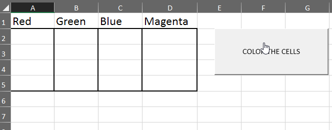

## 2.3 Scripting Practice in VBA

### Overview

Today’s lesson is the conclusion of our in-depth week on VBA scripting, formatting, and loops.
During the second half of class, students will work on a short project.

### Class Objectives

By the end of this lesson, the students will be able to:

* Format spreadsheets by using VBA code.
* Loop through a table by using VBA code and check for changes in values.

---

### Instructor Notes

* Students will spend much of today's class working in groups on a small-scale project that covers everything that they have learned so far. While this activity may be challenging, it will be a good indicator of how well the students will be able to handle this week's homework.

* Coding can be stressful, and many of your students may be feeling the pressure of learning so much in such a short amount of time. Keep them confident and motivated. Make jokes, and try to keep them smiling. Assure them that perseverance is a critical facet of programming. Any code will function eventually, as long as you keep at it.

* This lesson marks the first time we will be offering students a significant portion of the class time to complete a small-scale project. Be sure to set concrete stopping points where you bring everyone in the class back together to go over individual parts of the code. This ensures no student or group is left behind if they are struggling.

---

### Class Slides

* The slides for this lesson can be viewed on Google Drive here: [Lesson 2.3 Slides](https://docs.google.com/presentation/d/1s1B-vc1c0XmWl0jDrU55LapwJMJrrIViGTxDhrtu_FM/edit?usp=sharing).

* To add the slides to the student-facing repository, download the slides as a PDF by navigating to File, selecting "Download as," and then choosing "PDF document." Then, add the PDF file to your class repository along with other necessary files. You can view instructions for this [here](https://docs.google.com/document/d/1XM90c4s9XjwZHjdUlwEMcv2iXcO_yRGx5p2iLZ3BGNI/edit).

* **Note:** Editing access is not available for this document. If you wish to modify the slides, create a copy by navigating to File and selecting "Make a copy...".

---

### Time Tracker

| Start Time | Number | Activity                                           | Duration |
| ---------- | ------ | -------------------------------------------------- | -------- |
| 6:30 PM    | 1      | Instructor Do: Welcome Students and Pep Talk       | 0:15     |
| 6:45 PM    | 2      | Students Do: Star Counter                          | 0:15     |
| 7:00 PM    | 3      | Review: Star Counter                               | 0:05     |
| 7:05 PM    | 4      | Instructor Do: VBA Formatting                      | 0:05     |
| 7:10 PM    | 5      | Students Do: VBA Grade Book                        | 0:15     |
| 7:25 PM    | 6      | Review: Grade Book                                 | 0:05     |
| 7:30 PM    | 7      | Partners Do: Checkerboard                          | 0:15     |
| 7:45 PM    | 8      | Review: Checkerboard                               | 0:05     |
| 7:50 PM    | 9      | Instructor Do: Looking to the Next Cell            | 0:05     |
| 7:55 PM    | 10     | Students Do: Card Checker - Cell Comparison        | 0:20     |
| 8:15 PM    | 11     | Review: Card Checker                               | 0:10     |
| 8:25 PM    | 12     | BREAK                                              | 0:15     |
| 8:40 PM    | 13     | Instructor Do: U.S. Census Setup                   | 0:05     |
| 8:45 PM    | 14     | Everyone Do: U.S. Census - Part 1                  | 0:20     |
| 9:05 PM    | 15     | Everyone Do: U.S. Census - Part 2                  | 0:20     |
| 9:25 PM    | 16     | End Class                                          | 0:05     |
| 9:30 PM    |        | END                                                |          |

---

### 1. Instructor Do: Welcome Students and Pep Talk (15 min)

Welcome your class to their final day of VBA.

Students have probably noticed that this unit has been more challenging than the previous one. They may even be feeling a little stressed out or frustrated. Let them know that everything is going to be okay. For many of them, this week marks their first foray into programming, and no one expects perfection on the first go. Reassure them that as long as they put in the hours to practice and don’t give up hope, they will come out of this week with a strong understanding of basic programming.

Open the slideshow, and go through the slides. Along the way, explain the following:

  * Tell students that programming takes time to learn, and trying to learn everything at the last minute is tough.

  * Explain that it’s important that students study correctly, and if something takes too long, they should ask for help.

  * Have students try to explain what a `for` loop does. Use the slides to provide a visualization of how a `for` loop works.

  * Have students try to explain what a nested `for` loop does. Use the slides to provide a visualization of how a nested `for` loop works.

  * Finally, answer any questions that students may have.

---

### 2. Students Do: Star Counter (15 min)

**Corresponding Activity:** [01-Stu_StarsCounter](Activities/01-Stu_StarsCounter)

Start today's class off with a short warm-up and review of what we covered during our last two meetings.

We'll be sending students an Excel spreadsheet containing 50 rows of "review data" for Spanish and French online language courses. Using their knowledge of VBA, students will determine the total number of stars that each user gave their respective program; they will then find the total number of stars both programs received.

The following GIF captures the resulting spreadsheet:


**File:** [star_counter.xlsm](Activities/01-Stu_StarsCounter/Unsolved/star_counter.xlsm)

**Instructions:** [README.md](Activities/01-Stu_StarsCounter/README.md)

---

### 3. Review: Star Counter (5 min)

Open up [star_counter_with_VBA_solution.xlsm](Activities/01-Stu_StarsCounter/Solved/star_counter_with_VBA_solution.xlsm), go through the code with your class, and check for any questions.

In your discussion of the basic solution, be sure to point out the following:

  * The code loops through Rows 2 to 51 in our first loop.

  * For each row in the first loop, the code then loops through Columns 4 to 8 for that row within the second loop.

  * Every time we find a "Full-Star" value within a column, we add one to our `StarCounter`.

  * The value of `StarCounter` is placed within a new cell after the conclusion of the second loop, and then we move on to the next value in the first loop.

  ```vb
  Sub StarCounter()

    ' Create a variable to hold the StarCounter. We will repeatedly use this.
    dim StarCounter as Integer

    ' Loop through each row
    for i = 2 to 51

      ' Initially set the StarCounter to be 0 for each row
      StarCounter = 0

      ' While in each row, loop through each star column
      for j = 4 to 8

        ' If a column contains the word "Full-Star"...
        if (Cells(i, j).value = "Full-Star") then

          ' Add 1 to the StarCounter
          StarCounter = StarCounter + 1

        end if

      Next j

      ' Once we've iterated through each column in row i, print the value in the total column.
    Cells(i, 9).value = StarCounter

    Next i

  End Sub
  ```

Data Source: Data for this dataset was generated by edX Boot Camps LLC, and is intended for educational purposes only.

---

### 4. Instructor Do: VBA Formatting (5 min)

**Corresponding Activity:** [02-Ins_Formatter](Activities/02-Ins_Formatter)

Not only can we use VBA to change the values within cells, but we can also easily code in formatting with a variety of functions.

The following image captures four unformatted columns:

  

Open [formatter_solution.xlsm](Activities/02-Ins_Formatter/Solved/formatter_solution.xlsm) in Excel, and explain to students how we can use VBA to fill each of these cells with their respective colors.

  * Within the VBA editor, write the following code:

  ```vb
  Sub formatter()

    ' Set the Font color to Red
    Range("A1").Font.ColorIndex = 3

    ' Set the Cell Colors to Red
    Range("A2:A5").Interior.ColorIndex = 3
  ```

Check if your students can guess what this code will do.

  * “The text in cell A1 will be colored red.”

  * “The interiors of cells A2 to A5 will be filled with red as well.”

  * The following GIF demonstrates the result of our code:

  

  * Your students may be wondering about the value "3" and how it corresponds to the color red. The answer is that Excel has divided its palette into 56 colors and assigned each color a numeric value. Your students can find a helpful chart for these values by following [this link](http://dmcritchie.mvps.org/excel/colors.htm).

Now that your students have a guide to the colors, have them help you create the code that will color Columns B, C, and D.

  * The following GIF captures the result of our code:

  

  * Point out how the code is mostly the same as when we painted the cells red; the only values that change are the cells referenced and the numeric color values.

Check if your students have any questions regarding VBA formatting before moving on to the next activity.

---

### 5. Students Do: VBA Grade Book (15 min)

**Corresponding Activity:** [03-Stu_Gradebook-Conditionals](Activities/03-Stu_Gradebook-Conditionals)

Now, your students will create an Excel application that checks a fictional student's grade and performs actions based on the grade.

The following GIF captures this application in action:

  

Once you have guided students through an example of how this application will function, send out the starter file and instructions.

**File:** [grader.xlsm](Activities/03-Stu_Gradebook-Conditionals/Unsolved/grader.xlsm)

**Instructions:** [README.md](Activities/03-Stu_Gradebook-Conditionals/README.md)

---

### 6. Review: Grade Book (5 min)

Open [grader_solution.xlsm](Activities/03-Stu_Gradebook-Conditionals/Solved/grader_solution.xlsm), go through the code with your class, and check for any questions.

While discussing the solution, be sure to cover the following points:

  * Point out how you are modifying the formatting and value of Cells B2 and C2 based on the value stored within A2. When the value of A2 changes, so does the formatting and value of Cells B2 and C2.

  * Due to the number of possible inputs, our code includes plenty of conditionals to account for every possible letter grade, for example:

    ```vb
    Sub GradeBook()

      ' Check if the student's grade is greater than or equal to 90...
      If Cells(2, 2).Value >= 90 Then

          ' Establish that the grade is Passing
          Cells(2, 3).Value = "Pass"

          ' Color the Passing grade green
          Cells(2, 3).Interior.ColorIndex = 4

          ' Set the letter grade to "A"
          Cells(2, 4).Value = "A"

      ' Check if the student's grade is greater than or equal to 80...
      ElseIf Cells(2, 2).Value >= 80 Then

          ' Establish that the grade is Passing
          Cells(2, 3).Value = "Pass"

          ' Color the Passing grade green
          Cells(2, 3).Interior.ColorIndex = 4

          ' Set the letter grade to "B"
          Cells(2, 4).Value = "B"
    ```

  * For the bonus, the code needs to collect the previous values of A2, B2, and C2 before moving the values into three new cells and then clearing the information stored in Row 2.

---

### 7. Partners Do: Checkerboard (15 min)

**Corresponding Activity:** [04-Stu_Checkerboard-CodingLogic](Activities/04-Stu_Checkerboard-CodingLogic)

Emphasize to students that this next activity is designed to help them understand coding logic; the VBA formatting involved is secondary to the underlying logic.

Students must create an 8-by-8 checkerboard pattern using only VBA scripts. This means creating a script that formats cells based on whether they are even or odd. Open [checkerboard_solution.xlsm](Activities/04-Stu_Checkerboard-CodingLogic/Solved/checkerboard_solution.xlsm), and demonstrate the solution.

  * The following GIF captures the demonstration of the solution.

  

**Instructions:** [README.md](Activities/04-Stu_Checkerboard-CodingLogic/README.md)

---

### 8. Review: Checkerboard (5 min)

Open [checkerboard_solution.xlsm](Activities/04-Stu_Checkerboard-CodingLogic/Solved/checkerboard_solution.xlsm), review the code with your class, and check for any questions.

While discussing this activity's solution, note that this is not the “correct” or “optimal” way to solve this problem. Check in with students as you go, and ask if they did anything differently.

Be sure to cover the following points:

  * This solution uses two `for` loops, a variable, and an `if-else` conditional.

  * With each iteration of our loops, the variable goes up by one.

  * If the variable is even, the cell is formatted to be black. Otherwise, it is formatted to be red.

```vb
Sub CheckerBoard()

  ' Setup a counter to track cell number
  Dim cellnumber as Integer
  Dim i, j As Integer
  cellnumber = 1

  ' Loop through each row of the board
  For i = 1 to 8

    ' Loop through each column of the board
    For j = 1 to 8

      ' If we are on a cell that is divisible by 2 then color it black
      If (cellnumber Mod 2 = 0) then

        Cells(i, j).Interior.ColorIndex = 1

      ' Otherwise color it red
      Else

        Cells(i, j).Interior.ColorIndex = 3

      End if

      ' Add one to our cell number each time
      cellnumber = cellnumber + 1

    Next j

    ' Whenever we start on a new row, we also add one to the cell number (to create the alternation)
    cellnumber = cellnumber + 1

  Next i

End Sub
```

---

### 9. Instructor Do: Looking to the Next Cell (5 min)

**Corresponding Activity:** [05-Ins_NextCells](Activities/05-Ins_NextCells)

When looping through rows and/or columns, it can be necessary to check for changes and then run some alternative code based on those changes.

  * For example, you might want to count how many cells in a column contain a specific value. One way to do this is to loop through the cells, comparing each cell to the one below it, and add 1 to a counter if both cells match.

Open up [next_cells.xlsx](Activities/05-Ins_NextCells/Solved/next_cells.xlsx), and copy the code from [next_cells_solution.vbs](Activities/05-Ins_NextCells/Solved/next_cells_solution.vbs) into the VBA editor.

The following image captures the contents of the Excel file.


Go through the code with your students.

  * Point out how we are looping through the rows in the first column and printing a message to the screen whenever the value changes from one row to the next.

  * Feel free to change the column variable to 2 and then 3 to show students how this code is checking for changes against the previous value (Texas versus New York, New York versus Nebraska, Nebraska versus Texas)

Check for any questions before moving on to the next activity.

---

### 10. Students Do: Card Checker - Cell Comparison (20 min)

**Corresponding Activity:** [06-Stu_CreditCardChecker-CellComparison](Activities/06-Stu_CreditCardChecker-CellComparison)

This activity is designed to solidify how important it is to check for changes in cell values and perform calculations whenever those changes occur.

Students will use a VBA script to create a summary table based on a series of values stored in an Excel spreadsheet, as captured in the following GIF:


Once you have demonstrated to students what they will be working to accomplish, send out the data file and instructions for this activity.

**File:** [credit_charges.xlsm](Activities/06-Stu_CreditCardChecker-CellComparison/Unsolved/credit_charges.xlsm)

**Instructions:** [README.md](Activities/06-Stu_CreditCardChecker-CellComparison/README.md)

---

### 11. Review: Card Checker (10 min)

Open up [credit_charges_solution.xlsm](Activities/06-Stu_CreditCardChecker-CellComparison/Solved/credit_charges_solution.xlsm), review the code with your class, and check for any questions.

Cover the following key points in your review of this activity:

  * The code loops through all of the rows containing credit card purchases.

  * The code then checks for instances when the contents of a cell in Column A do not match the contents of the cell in the following row.

  * Whenever the contents of the two cells do not match, we print the contents of the first cell to a message box before continuing.

  ```vb
  Sub credit_card()

    ' Set an initial variable for holding the brand name
    Dim Brand_Name As String

    ' Loop through all credit card purchases
    For i = 2 To 101

      ' Check if we are still within the same credit card brand, if we are not...
      If Cells(i + 1, 1).Value <> Cells(i, 1).Value Then

        ' Message Box the unique Bank Name
        MsgBox(Cells(i, 1).Value)

      End If

    Next i

  End Sub
  ```

Cover the following key points for the advanced solution:

  * The code is very similar to the basic solution. The main difference is that it is now adding to the `Brand_Total` variable whenever a different value in Column A is _not_ found.

  * Whenever a change _is_ found, the application will add the value of the final row of the brand to the total before placing the `Brand_Name` and `Brand_Total` into a summary table.

  * The `Summary_Table_Row` variable keeps track of the row where we should print the next line of data so that there is no overwriting.

  ```vb
  Sub credit_card()

    ' Set an initial variable for holding the brand name
    Dim Brand_Name As String

    ' Set an initial variable for holding the total per credit card brand
    Dim Brand_Total As Double
    Brand_Total = 0

    ' Keep track of the location for each credit card brand in the summary table
    Dim Summary_Table_Row As Integer
    Summary_Table_Row = 2

    ' Loop through all credit card purchases
    For i = 2 To 101

      ' Check if we are still within the same credit card brand, if it is not...
      If Cells(i + 1, 1).Value <> Cells(i, 1).Value Then

        ' Set the Brand name
        Brand_Name = Cells(i, 1).Value

        ' Add to the Brand Total
        Brand_Total = Brand_Total + Cells(i, 3).Value

        ' Print the Credit Card Brand in the Summary Table
        Range("G" & Summary_Table_Row).Value = Brand_Name

        ' Print the Brand Amount to the Summary Table
        Range("H" & Summary_Table_Row).Value = Brand_Total

        ' Add one to the summary table row
        Summary_Table_Row = Summary_Table_Row + 1

        ' Reset the Brand Total
        Brand_Total = 0

      ' If the cell immediately following a row is the same brand...
      Else

        ' Add to the Brand Total
        Brand_Total = Brand_Total + Cells(i, 3).Value

      End If

    Next i

  End Sub
  ```

Data Source: Data for this dataset was generated by edX Boot Camps LLC, and is intended for educational purposes only.

---

### 12. BREAK (15 min)

---

### 13. Instructor Do: U.S. Census Setup (5 min)

For the rest of class, students will work in small groups to create a VBA script that takes an Excel workbook with multiple sheets of U.S. Census data, formats each sheet to improve readability, and then combines all of the data into a single table.

Let students know that we’ll use Census data throughout the course. Later on, students will learn how to access the data themselves, but for this exercise, we will use precollected data from the Census API.

Students should place one person from their group in charge of writing the code. This arrangement promotes collaboration and ensures that students work at the same general pace.

Let students know that this activity will be divided into parts, and we will review each part as a class before moving on.

---

### 14. Everyone Do: U.S. Census - Part 1 (20 min)

**Corresponding Activity:** [07-Stu_Census_Pt1](Activities/07-Stu_Census_Pt1)

**File:** [census_data_2016-2019_pt1.xlsm](Activities/07-Stu_Census_Pt1/Unsolved/census_data_2016-2019_pt1.xlsm)

**Instructions:** [README.md](Activities/07-Stu_Census_Pt1/README.md)

Use this section as guidance for talking points as you live-code with the students.

Be sure to take your time and answer all student questions along the way.

* Open up [census_data_2016-2019_pt1_solution.xlsm](Activities/07-Stu_Census_Pt1/Solved/census_data_2016-2019_pt1_solution.xlsm), review the code with your class, and check for any questions.

Cover the following key points:

  * To loop through all worksheets using VBA, we use a `For Each` loop that loops through the built-in array of `Worksheets`.

    ```vb
    Sub Census_pt1()

        ' --------------------------------------------
        ' LOOP THROUGH ALL SHEETS
        ' --------------------------------------------
        For Each ws In Worksheets
    ```

  * To collect the year, the code looks at the name of the current worksheet, `ws.Name`, and then splits the name where underscores are used. The code can then place the extracted year by referencing `CensusYear(0)`, since the year is stored at index 0 in the `CensusYear` array.  Note that the code will cause an error if the array is named `Year`, which is why we use a more specific variable name.

    ```vb
        ' Create a Variable to Hold File Name, Last Row, and Year
        Dim WorksheetName As String

        ' Determine the Last Row
        LastRow = ws.Cells(Rows.Count, 1).End(xlUp).Row

        ' Grabbed the WorksheetName
        WorksheetName = ws.Name
        'MsgBox WorksheetName

        ' Split the WorksheetName
        CensusYear = Split(WorksheetName, "_")
        'MsgBox CensusYear(0)

        ' Add a Column for the Year
        ws.Range("A1").EntireColumn.Insert

        ' Add the word Year to the First Column Header
        ws.Cells(1, 1).Value = "Year"

        ' Add the Year to all rows
        ws.Range("A2:A" & LastRow) = CensusYear(0)
    ```

  * To collect the place and split it into two columns for county and state, the code adds a new “State” column after "Place" and then renames the headers. Next, it loops through the "Place" column and splits the contents at the comma; then, it places the County value at index 0 into the "County" cell and the State value at index 1 into the "State" cell.

    ```vb
        ' --------------------------------------------
        ' SPLIT COUNTY AND STATE
        ' --------------------------------------------

        ' Add the State Column after County
        ws.Range("C1").EntireColumn.Insert

        ' Rename Place to County
        ws.Cells(1, 2).Value = "County"

        ' Label State Column
        ws.Cells(1, 3).Value = "State"

        ' Split County and State and store values in appropriate
        ' column by looping through and renaming each
        For i = 2 To LastRow
            CountyState = ws.Cells(i, 2).Value
            CSSplit = Split(CountyState, ", ")
            'MsgBox CSSplit(1)
            ws.Cells(i, 2).Value = CSSplit(0)
            ws.Cells(i, 3).Value = CSSplit(1)
            ' MsgBox Cells(i, 2)
            ' MsgBox CSSplit(0)

        Next i
    ```

  * Finally, to add the currency number format to our income data, the code simply loops through all rows from Row 2 on and the two columns that refer to income&mdash;now the sixth and seventh columns in the sheet&mdash;and applies the "Currency" style.

    ```vb
        ' --------------------------------------------
        ' CORRECT THE CURRENCY FORMAT
        ' --------------------------------------------

        ' Add the currency
        For i = 2 To LastRow

            ' For columns Household and Per Capita Income only
            For j = 6 To 7

                ws.Cells(i, j).Style = "Currency"

            Next j

        Next i
    ```

Send out the code for this part of the activity so that any groups that may have fallen behind can move on to Part 2.

Data Source: [U.S. Census API - ACS 5-Year Estimates 2016-2019](https://www.census.gov/data/developers/data-sets/census-microdata-api.ACS_5-Year_PUMS.html)

---

### 15. Everyone Do: U.S. Census - Part 2 (20 min)

**Corresponding Activity:** [08-Stu_Census_Pt2](Activities/08-Stu_Census_Pt2)

In this second part of the project, we will be combining all the worksheets into one massive table in a new sheet.

  * They will need to loop through each sheet, select each row of data, and move it into the new sheet.

  * The following image captures the resulting spreadsheet:

    

Once you’ve described the solved version of the activity, send out the following file and instructions:

**File:** [census_data_2016-2019_pt2.xlsm](Activities/08-Stu_Census_Pt2/Unsolved/census_data_2016-2019_pt2.xlsm)

**Instructions:** [README.md](Activities/08-Stu_Census_Pt2/README.md)

Use this section as guidance for talking points as you live-code with the students.

  * Be sure to take your time and answer all student questions along the way.

Open up [census_data_2016-2019_pt2.xlsx](Activities/08-Stu_Census_Pt2/Unsolved/census_data_2016-2019_pt2.xlsm) and use [census_pt2_solution.vbs](Activities/08-Stu_Census_Pt2/Solved/census_pt2_solution.vbs) as your guide. Now, review the combined solution with your class, and check for any questions.

Cover the following key points for this part of the activity:

  * The code sets a variable for the location of the "Combined_Data" worksheet in the workbook. If this sheet has not been created, the code should return an error.

  * Once again, the code uses a `For Each` loop to move through each worksheet in the workbook.

  * The code finds the final row on each sheet and then collects all the data on the sheet before transplanting it into the combined sheet.

```vb
Sub Census_pt2()

    ' Add a sheet named "Combined Data"
    Sheets.Add.Name = "Combined_Data"
    'move created sheet to be first sheet
    Sheets("Combined_Data").Move Before:=Sheets(1)
    ' Specify the location of the combined sheet
    Set combined_sheet = Worksheets("Combined_Data")

    ' Loop through all sheets
    For Each ws In Worksheets

        ' Find the last row of the combined sheet after each paste
        ' Add 1 to get first empty row
        lastRow = combined_sheet.Cells(Rows.Count, "A").End(xlUp).Row + 1

        ' Find the last row of each worksheet
        ' Subtract one to return the number of rows without header
        lastRowYear = ws.Cells(Rows.Count, "A").End(xlUp).Row - 1

        ' Copy the contents of each year sheet into the combined sheet
        combined_sheet.Range("A" & lastRow & ":K" & ((lastRowYear - 1) + lastRow)).Value = ws.Range("A2:K" & (lastRowYear + 1)).Value

    Next ws

    ' Copy the headers from sheet 1
    combined_sheet.Range("A1:K1").Value = Sheets(2).Range("A1:K1").Value

    ' Autofit to display data
    combined_sheet.Columns("A:K").AutoFit

End Sub
```

Data Source: [U.S. Census API - ACS 5-Year Estimates 2016-2019](https://www.census.gov/data/developers/data-sets/census-microdata-api.ACS_5-Year_PUMS.html)

---

### 16. End Class (5 min)

Before dismissing class, let the students know that they will need to install some new tools before the beginning of the next class. If they run into any issues, they should attend office hours before the beginning of the next class.

---

© 2022 edX Boot Camps LLC. Confidential and Proprietary. All Rights Reserved.
