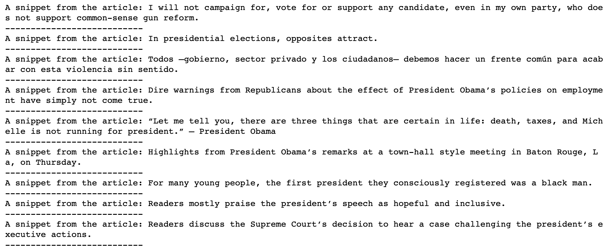

## 6.1 APIs

### Overview

In today’s lesson, students will be introduced to JSON traversal and the fundamentals of making API requests with the [Requests library](http://docs.python-requests.org/en/latest/), using the [OMDb](https://www.omdbapi.com/) and [New York Times](https://developer.nytimes.com/) APIs.

### Class Objectives

By the end of this lesson, the students will be able to:

* Make `get` requests with the Request library.

* Convert JSON into a Python dictionary.

* Read and apply API documentation.

* Sign up for and use an API key.

---

### Instructor Priorities

* Students will make `get` requests with the Requests library.

* Students will manipulate JSON responses to retrieve necessary values.

* Students will store JSON responses in python lists and dictionaries.

* Students will use the OMDb API documentation to figure out the query strings needed to create requests for the movie data they are asked to retrieve.

### Instructor Notes

* The NYT API imposes rate limits on requests. It shouldn't interfere with instructor demonstrations or student exercises, but keep it in mind as a potential source of errors.

* You will need to provide your own unique NYT API key for the instructor demonstration and the student activity.

---

### Class Slides

* The slides for this lesson can be viewed on Google Drive here: [Lesson 1.3 Slides](https://docs.google.com/presentation/d/1ZE5N8M6T3atjpEf4FEwXj9eiP6hWPKv_z3i5xx25PmI/edit?usp=sharing).

* To add the slides to the student-facing repository, download the slides as a PDF by navigating to File, selecting "Download as," and then choosing "PDF document." Then, add the PDF file to your class repository along with other necessary files. You can view instructions for this [here](https://docs.google.com/document/d/1XM90c4s9XjwZHjdUlwEMcv2iXcO_yRGx5p2iLZ3BGNI/edit).

* **Note:** Editing access is not available for this document. If you wish to modify the slides, create a copy by navigating to File and selecting "Make a copy...".

---

### Time Tracker

| Start Time | Number | Activity                                           | Duration |
| ---------- | ------ | -------------------------------------------------- | -------- |
| 6:30 PM    | 1      | Instructor Do: Intro to APIs                       | 0:05     |
| 6:35 PM    | 2      | Instructor Do: Intro to Requests                   | 0:05     |
| 6:40 PM    | 3      | Students Do: Requesting SpaceX                     | 0:10     |
| 6:50 PM    | 4      | Review: Requesting SpaceX                          | 0:05     |
| 6:55 PM    | 5      | Instructor Do: Manipulating Responses              | 0:05     |
| 7:00 PM    | 6      | Students Do: Requesting a Galaxy Far, Far Away     | 0:15     |
| 7:15 PM    | 7      | Review: Far, Far Away API Request                  | 0:05     |
| 7:20 PM    | 8      | Partners Do: Number Facts - API Application        | 0:20     |
| 7:40 PM    | 9      | Review: Number Facts                               | 0:05     |
| 7:45 PM    | 10     | BREAK                                              | 0:15     |
| 8:00 PM    | 11     | Instructor Do: OMDb API                            | 0:10     |
| 8:10 PM    | 12     | Students Do: Study the OMDb API                    | 0:05     |
| 8:15 PM    | 13     | Students Do: Movie Questions                       | 0:20     |
| 8:35 PM    | 14     | Review: Movie Questions                            | 0:05     |
| 8:40 PM    | 15     | Instructor Do: Iterative Requests                  | 0:05     |
| 8:45 PM    | 16     | Students Do: Movie Iterative Requests              | 0:10     |
| 8:55 PM    | 17     | Review: Movie Iterative Requests                   | 0:05     |
| 9:00 PM    | 18     | Instructor Do: NYT API                             | 0:05     |
| 9:05 PM    | 19     | Students Do: Retrieving Articles                   | 0:20     |
| 9:25 PM    | 20     | Review: Retrieving Articles                        | 0:05     |
| 9:30 PM    |        | END                                                |          |

---

### 1. Instructor Do: Intro to APIs (5 min)

Open the slideshow, and cover the first activity. Make sure to cover the following points:

Welcome the class, and let them know that today's lesson will focus on API calls.

Explain that a **client** is the application/device that _asks_ for information.

Explain that a **server** is an application/device that _supplies_ the information to the client.

* To provide an analogy, have students consider the example of a doctor asking for a patient's medical records. The doctor _requests_ information, so they are the **client** in this case. The hospital _provides_ the information and thus could be seen as the **server**. The medical records themselves are the _information_ requested.

Ask the class the following questions:

* Has anyone heard of the term API before?

* Can anyone define what an API is?

Explain that **API** stands for application programming interface.

* An API allows for clients and servers to communicate using their own language.

* In the simplest case, an API enables a client device to make a request to a server and then decipher the response.

Display and discuss the [API call diagram](Images/01-APIIntro_Diagram.png) with students.

  

Point out how, in the diagram, the client only _requests_ information, which the server then provides.

Explain that an API call that focuses on retrieving data is called a **get request**.

* There are other ways for clients to interact with servers, but these methods are not necessary for today's activities.

* API get requests are not all that different from simply visiting a website. Often, an API will use a URL to communicate, and the client will use a program to collect some data from the page.

You may display and discuss the example JSON in the slide deck, or you may visit the [JSON Placeholder page](https://jsonplaceholder.typicode.com/posts/) and explain the webpage’s contents, which are captured in the following image:

  

* This webpage acts as an example of a JSON file that would be returned by an API call. Tell students not to worry about the formatting or syntax of this object at the moment.

* The URL is no different from the URLs that students use to visit "normal" websites.

* Explain that the URLs used to communicate with APIs are often called **endpoints**.

* Explain that the text inside of the web browser is _identical_ to what a client script would receive when making a call to this endpoint.

Explain that the de facto standard library for making API calls in Python is [requests.py](https://docs.python-requests.org/en/latest/).

Before the next activity, you may want to direct students to the [JSON formatter extension](https://chrome.google.com/webstore/search/json%20formatter) offered by the Chrome Web Store.

---

### 2. Instructor Do: Intro to Requests (5 min)

**Corresponding Activity:** [01-Ins_RequestsIntro](Activities/01-Ins_RequestsIntro)

Open the slideshow to accompany the beginning of this demonstration.

Explain that for this class, we will use Python's Requests library to interact with web servers.

* The `requests.get()` function is used to interact with a URL-based API query. It navigates to the URL and then attempts to retrieve the response from the webpage.

* In most cases, we can expect the `requests.get()` function to return a `response` object that contains the JSON (or some other highly-parsable text format) response from the API.

* To interpret and analyze the `response` object, we will use the `.json()` function to interact with our other Python libraries.

Open [requests_demo_solution.ipynb](Activities/01-Ins_RequestsIntro/Solved/requests_demo_solution.ipynb) in Jupyter Notebook, and go through the code with the class.

* `import requests` pulls the Requests library into Python. This will allow the code to make API calls and collect data from a server.

* `import json` allows Python to pull in and parse JSON objects.

* The `url` variable contains a string with the SpaceX URL that the class visited.

* Explain that `requests.get(url)` sends a get request to the URL, passed as a parameter, as captured in the following image. Remind students that this means that the program is _requesting_ the information stored at this URL.

  

* Explain that `requests.get(url)` returns a response object containing information about the server's response, but it does not seem to include the requested JSON, as captured in the following image:

  

* The `.json()` call must be used to convert the response object we receive into the JSON format that we encountered earlier in the browser.

* Point out how the JSON response is contained within one massive block of text. This makes it very hard to understand or read through. To counteract this, the `json.dumps()` method can be used to "pretty print" the response, as in the following image:

  

---

### 3. Students Do: Requesting SpaceX (10 min)

**Corresponding Activity:** [02-Stu_SpaceX-Request](Activities/02-Stu_SpaceX-Request)

In this activity, students will explore a simple, well-documented API&mdash;The SpaceX API&mdash;and make calls to the API using the Requests library.

Open [spacex_solution.ipynb](Activities/02-Stu_SpaceX-Request/Solved/spacex_solution.ipynb) in Jupyter Notebook.

Open the slideshow to display the instructions and example JSON response.

---

### 4. Review: Requesting SpaceX (5 min)

Open [spacex_solution.ipynb](Activities/02-Stu_SpaceX-Request/Solved/spacex_solution.ipynb) in Jupyter Notebook, share the notebook with students, and go through the code with the class line by line. Make sure to cover the following points:

* Although it is not required to "pretty print" the JSON response, it does make it a lot easier to understand, so we use `json.dumps()` and pass in the desired formatting parameters, as captured in the following image:

  

* To modify an API call to search for a single ID, use concatenation or string substitution to build the correct URL, as in the `requests.get()` method captured in the following image:

  

---

### 5. Instructor Do: Manipulating Responses (5 min)

**Corresponding Activity:** [03-Ins_ManipulatingResponses](Activities/03-Ins_ManipulatingResponses)

Open the slideshow to accompany the beginning of this demonstration.

Point out that in the solution to the previous activity, we used the API responses immediately by printing the JSON to the screen.

However, the JSON response can also be saved within a variable, allowing the application to refer to the dictionary multiple times and inspect its properties.

* JSON is structurally similar to Python's dictionaries as both data formats use "key" and "value" pairings.

Open [manipulating_json_solution.ipynb](Activities/03-Ins_ManipulatingResponses/Solved/manipulating_json_solution.ipynb) within Jupyter Notebook, and go through the code with the class.

* As long as a response has been parsed using `response.json()`, as captured in the following image, we can navigate through and collect values like we would with a dictionary.

  

* Point out how the application accesses the value stored within the "cost_per_launch" key using `["cost_per_launch"]`, as annotated in the following image:

  

* Both Python dictionaries and JSON objects can contain dictionaries within dictionaries. To access the data stored within these subdictionaries, simply pass the parent key within brackets and then follow it with the child key in a second set of brackets. In this case, since there is an array of subdictionaries, you must also use the index of the subdictionary before passing the child key, as annotated in the following image:

  

---

### 6. Students Do: Requesting a Galaxy Far, Far Away (15 min)

**Corresponding Activity:** [04-Stu_FarFarAway-APIData](Activities/04-Stu_FarFarAway-APIData)

Students will now create an application that accesses data and prints out values from the Star Wars API.

Open the slideshow to accompany this activity. Otherwise, show and discuss the chart that students will be attempting to create, which is captured in the following image:

  

---

### 7. Review: Far, Far Away API Request (5 min)

Open up [04-Stu_FarFarAway-APIData/far_far_away_solution.ipynb](Activities/04-Stu_FarFarAway-APIData/Solved/far_far_away_solution.ipynb) in Jupyter Notebook, and go through the code with the class line by line. Make sure to cover the following points:

* Printing out the original JSON, as captured in the following image, is critical to understanding what keys and values an application should collect. It is also a crucial part of what is known as "Test Driven Development," as it enables the programmer to know what their outputs should be.

  

* To collect the character's name, reference the `["name"]` key and store it within a variable for later.

* To collect the number of films a character has been in, reference the `["films"]` key and collect the length of the list it returns.

* To collect the name of the character's first starship, reference the `["starships"]` key and the value at the index `[0]`. This returns a URL to use in a second API call. The name of the starship will be held within the `["name"]` key of this JSON object, as captured in the following image:

  

Ask the class how they would go about solving the bonus.

* Loop through the `["films"]` list, and run an API call for each value within the list. Then, from the JSON returned, collect the `["title"]` and append the titles into a list, as captured in the following image:

  

---

### 8. Partners Do: Number Facts - API Application (20 min)

**Corresponding Activity:** [05-Par_NumberFacts-APIApplication](Activities/05-Par_NumberFacts-APIApplication)

Students will now join forces to create an interactive application that uses the "numbers" API. The application will take in a number and then return a random fact about that number.

Open [number_facts_solution.ipynb](Activities/05-Par_NumberFacts-APIApplication/Solved/number_facts_solution.ipynb) in Jupyter Notebook, run the application, and display and discuss the results.

Open the slideshow to accompany this activity. Otherwise, display and describe the following image to help students understand what they’ll be creating.

  

---

### 9. Review: Number Facts (5 min)

Open [number_facts_solution.ipynb](Activities/05-Par_NumberFacts-APIApplication/Solved/number_facts_solution.ipynb) in Jupyter Notebook, and go through the code with the class line by line. Make sure to cover the following points:

* The URL format for the Numbers API is `http://numbersapi.com/<Number>/<Type>?json` unless the "Date" type is being used. If the "Date" type is used, then the format is `http://numbersapi.com/<Month>/<Day>/<Type>?json`.

* Since the API call format for "Date" is different, an `if` statement should check what type of data the user wants to search. This way, the API call can be changed based on their choice, as captured in the following code:

  ```python
  # Ask the user what kind of data they would like to search for
  question = ("What type of data would you like to search for? "
              "[Trivia, Math, Date, or Year] ")
  kind_of_search = input(question)

  # If the kind of search is "date" take in two numbers
  if(kind_of_search.lower() == "date"):

    # Collect the month to search for
    month = input("What month would you like to search for? ")
    # Collect the day to search for
    day = input("What day would you like to search for? ")

    # Make an API call to the "date" API and convert response object to JSON
    response = requests.get(f"{url}{month}/{day}/{kind_of_search.lower()}?json").json()
    # Print the fact stored within the response
    print(response["text"])

  # If the kind of search is anything but "date" then take one number
  else:

    # Collect the number to search for
    number = input("What number would you like to search for? ")

    # Make an API call to the API and convert response object to JSON
    response = requests.get(url + number + "/" +  kind_of_search.lower()+ "?json").json()
    # Print the fact stored within the response
    print(response["text"])
  ```

---

### 10. BREAK (15 min)

---

### 11. Instructor Do: OMDb API (10 min)

**Corresponding Activity:** [06-Ins_OMDbRequests](Activities/06-Ins_OMDbRequests)

Open the slideshow to accompany the beginning of this demonstration. Make sure to cover the following talking points:

* After having spent time working with simple JSON objects, students should now be ready to work with JSON responses from more complex APIs.

* Send students the link to the [OMDb API](https://www.omdbapi.com/), which will be used for the next few exercises.

* One major difference between the OMDb API and our previous API examples is the format of the URL. In this case, we will have to use URL parameters.

* The two basic parameters used in the OMDb API get request are `?t=` and `api_key`.

* Explain that the `t` within the URL string represents "title." This means that the URL `http://www.omdbapi.com/?t=Aliens` is asking the OMDb API to return all of the information on movies with the title "Aliens".

* Explain that the section of the URL following such a question mark is called a **query string**.

* Query strings are a way to send information from the client to the server, which the server can then interpret to return more specific data, as captured in the following code:

  ```python
  # Note that the ?t= is a query param for the t-itle of the
  # movie we want to search for.
  url = "http://www.omdbapi.com/?t="
  api_key = "&apikey=" + api_key

  # Performing a GET request similar to the one we executed
  # earlier
  response = requests.get(url + "Aliens" + api_key)
  ```

  This will produce a query string like `http://www.omdbapi.com/?t=Aliens&apikey={YOUR API KEY}`.

* The query string also includes something known as an "API Key" at the end. API keys are used by developers to collect data from APIs that have some layers of protection on them. Without a valid API key for the OMDb API, for example, no data would be returned.

Open the [omdb_requests_solution.ipynb](Activities/06-Ins_OMDbRequests/Solved/omdb_requests_solution.ipynb) demo in Jupyter Notebook.

Point out that this is nearly identical to the API calls students have been working with. The URL for the API is stored before an API call is made. The response is then stored and converted to JSON. The keys are then printed via dictionary access, as in the following image:

  

Point out that, other than the query string, there is nothing new here&mdash;students are now capable of interacting with complex real-world APIs!

---

### 12. Students Do: Study the OMDb API (5 min)

**Corresponding Activity:** [07-Stu_Explore_OMDb_API](Activities/07-Stu_Explore_OMDb_API)

For this first part of the OMDb activity, students will spend time reviewing the documentation for the OMDb API and testing it out.

Open the slideshow to display the instructions.

---

### 13. Students Do: Movie Questions (20 min)

**Corresponding Activity:** [08-Stu_MovieQuestions](Activities/08-Stu_MovieQuestions)

The class will now test their skills using the OMDb API as they attempt to collect data from the API to answer a series of questions.

Open the slideshow to display the instructions.

---

### 14. Review: Movie Questions (5 min)

Open [movie_questions_solution.ipynb](Activities/08-Stu_MovieQuestions/Solved/movie_questions_solution.ipynb) in Jupyter Notebook, and go through the code with the class line by line. Make sure to cover the following points:

* Point out that this activity did _not_ require the use of query string parameters other than `t`.

* Point out that each response contains lots of information for each movie by default. This activity could be solved by simply dumping the JSON and identifying the right key to retrieve.

---

### 15. Instructor Do: Iterative Requests (5 min)

**Corresponding Activity:** [09-Ins_IterativeRequests](Activities/09-Ins_IterativeRequests)

Open the slideshow to accompany the beginning of this demonstration.

Point out that with the APIs used so far, we've been able to retrieve the information we need using single requests.

Explain that sometimes, APIs will only respond to each request with _some_ of the information that we need.

* For example, it's common for APIs to send a limited amount of data in response to each call.

* The New York Times API for retrieving articles, for instance, only returns 10 at a time. In this case, if a programmer wanted to retrieve 30 articles, they would have to make 3 API calls.

Explain that API calls can be made _iteratively_ by sending get requests out from within a loop.

Point out that an application may want to retrieve a small subset of articles that have nonsequential IDs. For example, a user might want to retrieve the posts whose IDs are 3, 89, and 74, respectively.

* It would be wasteful to retrieve all 100 records, take the three that are desired, and throw away the rest. Rather, the application should request _only the articles needed_ and nothing more.

* Explain that this can be done by storing the desired IDs in a list and then making an API call inside a loop for each ID in the list.

Open [iterative_requests_solution.ipynb](Activities/09-Ins_IterativeRequests/Solved/iterative_requests_solution.ipynb).

* Explain that the line containing `random.sample` simply generates a list of random IDs between 1 and 100 to request from the API.

* Reassure students that they don't need to focus on this line just yet. Let them know that this code is to generate the data; it is not essential for learning iterative API requests.

* Explain that the `for` loop makes a request to the API for each ID in the list and stores the response in `response_json`, as captured in the following code and output text:

  ```python
  # Make a request for each of the indices
  for x in range(len(indices)):
      print(f"Making request number: {x} for ID: {indices[x]}")

      # Get one of the posts
      post_response = requests.get(url + str(indices[x]))

      # Save post's JSON
      response_json.append(post_response.json())
  ```

  ```text
  Making request number: 0 for ID: 55
  Making request number: 1 for ID: 4
  Making request number: 2 for ID: 57
  Making request number: 3 for ID: 98
  Making request number: 4 for ID: 59
  Making request number: 5 for ID: 66
  Making request number: 6 for ID: 92
  Making request number: 7 for ID: 97
  Making request number: 8 for ID: 23
  Making request number: 9 for ID: 82
  ```

Run the sample code a few times, and draw attention to the command-line output. Point out that the IDs are, indeed, random on each execution of the script.

---

### 16. Students Do: Movie Iterative Requests (10 min)

**Corresponding Activity:** [10-Stu_MovieLoop](Activities/10-Stu_MovieLoop)

The class will now test their knowledge of iterative requests by looping through a list of movies and collecting data from the OMDb API on each movie.

Explain to students that the next activity requires them to loop through a list and return information about that list. You may also want to display and describe the following image to help students understand the expected output:

  

Open the slideshow to display the instructions and sample output.

---

### 17. Review: Movie Iterative Requests (5 min)

Open [movie_loop_solution.ipynb](Activities/10-Stu_MovieLoop/Solved/movie_loop_solution.ipynb) in Jupyter Notebook, and run each cell after having students explain the code.

```python
# Dependencies
import requests
from config import api_key

url = "http://www.omdbapi.com/?apikey=" + api_key + "&t="

movies = ["Aliens", "Sing", "Moana"]

responses = []

# Make a request to the OMDb API for each movie in the list.
for movie in movies:
    movie_data = requests.get(url + movie).json()
    # Print the director of each movie
    print(f'The director of {movie} is {movie_data["Director"]}')
    # Save the responses in another list
    responses.append(movie_data)
```

---

### 18. Instructor Do: NYT API (5 min)

**Corresponding Activity:** [11-Ins_NYTAPI](Activities/11-Ins_NYTAPI)

Open the slideshow to accompany the beginning of this demonstration.

Explain that the final activity for the day is an exercise that explores another full-featured, real-world API, the New York Times article API.

Explain that up until now, we have been using APIs that do not require an API key. However, the NYT article API does require its users to register for an API key.

* Guide students through the process of acquiring an API key:

* First, create an account with NYT by filling out this [form](https://developer.nytimes.com/accounts/create), which is captured in the following image:

  

* Navigate to the index of the email used to sign up, and activate the account.

* **Note:** Make sure to have students check their spam folder for the email from the New York Times article API.

* Navigate back the [sign-in page](https://developer.nytimes.com/accounts/login), and log in with the newly created account.

Once students have successfully created a NYT account and logged in, it's time to create an app and obtain an API key.

* From the dropdown menu in the toolbar, in the top right next to their email, click **Apps**, as annotated in the following image:

  

* Click **+NEW APP**.

* This will bring you to the app creation page. Give the app any name you desire, as captured in the following image:

  

* Scroll down to the **Article Search API**, and select enable, as captured in the following image:

  

* Click the **SAVE** button at the bottom of the screen, as captured in the following image:

  

After the app is created, you will be redirected to the app page, which contains the API key, as captured in the following image. Explain to students that they will use this key to interact with the NYT API.

  

Send out the [documentation](https://developer.nytimes.com/docs/articlesearch-product/1/overview) for the NYT API, and provide a brief overview of its features, which are captured in the following image:

  

* Try not to delve too deeply into the documentation, however, as the next activity will have students reading through it to uncover the query strings that they need to create.

Explain that it is always a better idea to save your API keys in a separate config file from the scripts that use them.

* This adds security to your scripting/programming by dissociating your personal information from your analysis.

* You can also add all of your API keys from different sites into a single config file that your different API query scripts can point to.

Point out that it is critical to never publish your config files/API keys on GitHub.

* Many sites have a bandwidth limit that can easily be exceeded if more than one user uses a single API key. Additionally, some sites charge the user for each query.

Open the [nyt_api_solution.ipynb](Activities/11-Ins_NYTAPI/Solved/nyt_api_solution.ipynb) demo within Jupyter Notebook, and then run the application while explaining each part of the code.

* Highlight the use of the `config.py` file to store the `api_key`, as captured in the following image. Emphasize that it is best practice to not upload API keys to GitHub. Although this API key is free, students should always protect their keys from public view since some services charge past a certain usage point. Inform students that they should add `config.py` to their `.gitignore` file or create environment variables for all homework and projects that they will be saving to a repo.

  

---

### 19. Students Do: Retrieving Articles (20 min)

**Corresponding Activity:** [12-Stu_RetrieveArticles](Activities/12-Stu_RetrieveArticles)

Students will now create an application that grabs articles from the NYT API, stores them within a list, and prints snippets of the articles to the screen.

Open [retrieve_articles_solution.ipynb](Activities/12-Stu_RetrieveArticles/Solved/retrieve_articles_solution.ipynb) within Jupyter Notebook, and run and discuss the application to give students an idea of what they will be attempting to create, which is captured in the following image:

  

Open the slideshow to display the instructions and sample output.

---

### 20. Review: Retrieving Articles (5 min)

Open [retrieve_articles_solution.ipynb](Activities/12-Stu_RetrieveArticles/Solved/retrieve_articles_solution.ipynb) in Jupyter Notebook, and go through the code with the class line by line. Make sure to cover the following points:

* Ask different students to explain their solutions for each bullet point of the instructions.

* Focus on explaining the various query parameters used to build the query URL. These include:

  * `api-key`, the parameter that allows the code to query the server

  * `q`, for the keyword to **q**uery on

  * `begin_date` and `end_date`, both with format YYYYMMDD

Point out that the rest of the activity is similar to activities that students have already completed&mdash;the major difference is that they had to dig through documentation to find the right keys to use for this activity:

  ```python
  # Dependencies
  import requests
  import time
  from config import api_key

  url = "https://api.nytimes.com/svc/search/v2/articlesearch.json?"

  # Store a search term
  query = "obama"

  # Search for articles published between a begin and end date
  begin_date = "20160101"
  end_date = "20160130"

  query_url = f"{url}api-key={api_key}&q={query}&begin_date={begin_date}&end_date={end_date}"

  # Retrieve articles
  articles = requests.get(query_url).json()
  articles_list = articles["response"]["docs"]

  # Print out retrieved articles
  for article in article_list:
     print(f'A snippet from the article: {article["snippet"]}')
     print('---------------------------')
  ```

Briefly explain the solution to the bonus.

* Explain that each API call retrieves 10 articles by default. Each group of articles is called a _page_.

* If we want more articles, we need to tell the API to respond with _different pages_.

* To do this, we simply append a `page` parameter, which is equal to the number of the page that we want to retrieve.

* Point out that sending requests like this often exceeds the rate limit for free-tier users.

* Explain that a **rate limit** is a way for an API to throttle the number of requests a given application can make, to prevent abuse or server overload.

* **Note**: Warn students not to print the query URLs with their key included; this would jeopardize their key if pushed to a public repository.

---

© 2022 edX Boot Camps LLC. Confidential and Proprietary. All Rights Reserved.
