## 6.2:  Working with Weather and City APIs

### Overview

In today’s class, we’ll introduce a variety of new APIs while also covering exception handling and the use of Pandas with API responses.

### Class Objectives

By the end of this lesson, the students will be able to:

* Create applications from scratch by using nothing but their knowledge of Python and an API’s documentation.

* Load JSON from API responses into a Pandas DataFrame.

* Use `try` and `except` blocks to handle errors.

---

### Instructor Notes

Instructors should prioritize the following:

* Students should be able to use API documentation.

* Students should be able to use data from the OpenWeatherMap and World Bank APIs.

* Students should be able to load JSON from API responses into a Pandas DataFrame.

* Students should be able to use try-except blocks to handle exceptions.

---

### Class Slides

* The slides for this lesson can be viewed on Google Drive here: [Lesson 6.2 Slides](https://docs.google.com/presentation/d/1X0baVf7PZQy4n_eYI2ksSXdoNbNnnn1bPwdG1zm0J64/edit?usp=sharing).

* To add the slides to the student-facing repository, download the slides as a PDF by navigating to File, selecting "Download as," and then choosing "PDF document." Then, add the PDF file to your class repository along with other necessary files. You can view instructions for this [here](https://docs.google.com/document/d/1XM90c4s9XjwZHjdUlwEMcv2iXcO_yRGx5p2iLZ3BGNI/edit).

* **Note:** Editing access is not available for this document. If you wish to modify the slides, create a copy by navigating to File and selecting "Make a copy...".

---

### Time Tracker

| Start Time | Number | Activity                                           | Duration |
| ---------- | ------ | -------------------------------------------------- | -------- |
| 6:30 PM    | 1      | Students Do: JSON Traversal                        | 0:10     |
| 6:40 PM    | 2      | Review: JSON Traversal                             | 0:05     |
| 6:45 PM    | 3      | Students Do: Requests Review                       | 0:15     |
| 7:00 PM    | 4      | Review: Requests Review                            | 0:05     |
| 7:05 PM    | 5      | Instructor Do: OpenWeatherMap API                  | 0:10     |
| 7:15 PM    | 6      | Students Do: Weather in Burundi                    | 0:15     |
| 7:30 PM    | 7      | Review: Weather in Burundi                         | 0:05     |
| 7:35 PM    | 8      | Instructor Do: OpenWeatherMap DataFrame            | 0:10     |
| 7:45 PM    | 9      | Students Do: TV Ratings DataFrame                  | 0:10     |
| 7:55 PM    | 10     | Review: TV ratings                                 | 0:05     |
| 8:00 PM    | 11     | Students Do: Weather Statistics                    | 0:15     |
| 8:15 PM    | 12     | Review: Weather Statistics                         | 0:05     |
| 8:20 PM    | 13     | BREAK                                              | 0:15     |
| 8:35 PM    | 14     | Instructor Do: Exception Handling                  | 0:05     |
| 8:40 PM    | 15     | Students Do: Making Exceptions                     | 0:05     |
| 8:45 PM    | 16     | Review: Making Exceptions                          | 0:05     |
| 8:50 PM    | 17     | Student Do: API Call Exceptions                    | 0:15     |
| 9:05 PM    | 18     | Review: API Call Exceptions                        | 0:05     |
| 9:10 PM    | 19     | Instructor Do: World Bank API                      | 0:05     |
| 9:15 PM    | 20     | Partners Do: Two Calls                             | 0:10     |
| 9:25 PM    | 21     | Review: Two Calls                                  | 0:05     |
| 9:30 PM    |        | END                                                |          |

---

### 1. Students Do: JSON Traversal (10 min)

**Corresponding Activity:** [01-Stu_JSONTraversalReview](Activities/01-Stu_JSONTraversalReview)

Open the slideshow to introduce the class to the first activity.

Welcome the students to class, and explain that today we will work on expanding our API querying capabilities.

* Today's class will help us make our get requests more robust. We will also explore different methods of storing and analyzing our API responses.

Explain that we will begin with a short review of what was covered during the previous lesson. In this activity, students will be traversing a JSON file using their knowledge of Python.

Open [video_api_response.json](Activities/01-Stu_JSONTraversalReview/Resources/video_api_response.json) with a text editor, and discuss the JSON file that students will be working with, as captured in the following image:

  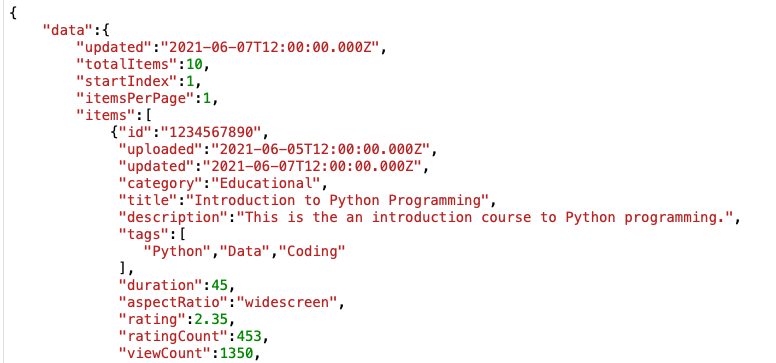

---

### 2. Review: JSON Traversal (5 min)

Open up [json_traversal_solution.ipynb](Activities/01-Stu_JSONTraversalReview/Solved/json_traversal_solution.ipynb) in Jupyter Notebook, send out the file to students, and go through the code with the class line by line. Make sure to hit upon the following points:

* Emphasize that the best way to solve problems like this one is to inspect the JSON manually and pull it apart once its structure is clear.

* Point out that this activity introduces no new techniques other than importing external JSON files. This challenge merely requires students to carefully read the JSON as they write their scripts.

Data Source: Data for this dataset was generated by edX Boot Camps LLC, and is intended for educational purposes only.

---

### 3. Students Do: Requests Review (15 min)

**Corresponding Activity:** [02-Stu_RequestReview](Activities/02-Stu_RequestReview)

Explain that students will review one more topic before they begin the bulk of today's lesson. For this activity, students will request data stored in JSON format on a remote server and then print out data from the response.

Open [requests_review_solution.ipynb](Activities/02-Stu_RequestReview/Solved/requests_review_solution.ipynb) in Jupyter Notebook, and run and discuss the code. Make sure that students understand what they are attempting to create, which is captured in the following image:

  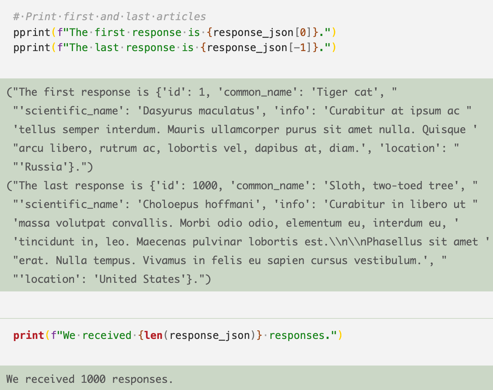

Open the slideshow to display the instructions.

---

### 4. Review: Requests Review (5 min)

Open [requests_review_solution.ipynb](Activities/02-Stu_RequestReview/Solved/requests_review_solution.ipynb) with Jupyter Notebook, and go through the code with the class line by line. As you go, ask different students how they implemented each task in the instructions.

* Make sure to point out how the first and last responses are being printed to the screen. The index of `[0]` will always contain the first value of a list, and the index of `[-1]` will always contain the last.

* To collect the length of the list, simply use the `len()` function and pass in the list as the sole parameter.

Data Source: Mockaroo, LLC. (2021). Realistic Data Generator. [https://www.mockaroo.com/](https://www.mockaroo.com/)

---

### 5. Instructor Do: OpenWeatherMap API (10 min)

**Corresponding Activity:** [03-Ins_OpenWeatherRequest](Activities/03-Ins_OpenWeatherRequest)

Open the slideshow to accompany the beginning of this demonstration.

Explain that the next API that students will work with is the [OpenWeatherMap API](https://openweathermap.org/api), which provides developers with various sorts of meteorological data.

Let students know that, like The New York Times API, the OpenWeatherMap API requires users to [register](https://home.openweathermap.org/users/sign_up) for an API key.

* Briefly take students through the [sign-up](https://home.openweathermap.org/users/sign_up) steps, and make sure that everyone has their API key ready before starting the demonstration.

  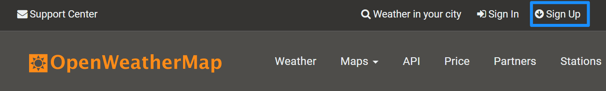

Remind students that it is best practice to use the `config.py` file to shield their api keys from public view.

Point out that the workflow for OpenWeatherAPI functions the same as the other APIs that we have previously covered.

Open [open_weather_request_solution.ipynb](Activities/03-Ins_OpenWeatherRequest/Solved/open_weather_request_solution.ipynb) with Jupyter Notebook, and discuss the output for the application, which is captured in the following image:

  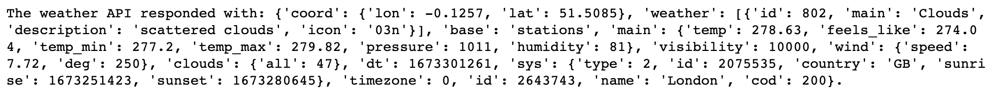

Ask a student to explain what the question mark in the URL indicates; if necessary, explain how the question mark represents the beginning of the query string.

Ask a student to explain what they think the query URL is requesting; if necessary, discuss how the `q` parameter allows the application to search for weather by city name in English.

Ask a student to explain the logic of the rest of the file, and then explain how the rest of the file simply sends a get request to the query URL, converts the response to JSON, and then prints the result.

---

### 6. Students Do: Weather in Burundi (15 min)

**Corresponding Activity:** [04-Stu_BurundiWeatherApp](Activities/04-Stu_BurundiWeatherApp)

The class will now work with the OpenWeather API and create an application that provides the user with the current temperature in the largest city in Burundi.

Before students complete the next activity, show and discuss the solution [Burundi_solution.ipynb](Activities/04-Stu_BurundiWeatherApp/Solved/Burundi_solution.ipynb) in Jupyter Notebook so that students understand the expected output.

Open the slideshow to display the instructions.

---

### 7. Review: Weather in Burundi (5 min)

Open [Burundi_solution.ipynb](Activities/04-Stu_BurundiWeatherApp/Solved/Burundi_solution.ipynb) in Jupyter Notebook, and go through the code with the class line by line. As you go, ask different students how they implemented each task in the instructions.

Try to focus on the following points:

* When building the query URL, remind students that this is the most important part of making an API call because it determines what information will be returned by the request.

* Explain the `units` query parameter, as captured in the following image. Remind students that they simply need to dig through documentation to find options like this. Encourage them to take time to read the documentation of an API before writing code; this undoubtedly will save them time and frustration.

```python
# Import dependencies
import requests
from config import api_key

# Save config information
url = "http://api.openweathermap.org/data/2.5/weather?"
city = "Bujumbura"
units = "metric"
```

```python
# Build query URL and request your results in Celsius
query_url = f"{url}appid={api_key}&q={city}&units={units}"

# Get weather data
weather_response = requests.get(query_url)
weather_json = weather_response.json()
```

```python
# Get temperature from JSON response
temperature = weather_json["main"]["temp"]
```

```python
# Report temperature
print(f"The temperature in Bujumbura is {temperature} C.")
```

```text
The temperature in Bujumbura is 21.75 C.
```

```python
# BONUS

# Use list of units
units = ["metric", "imperial"]

# Set up list to hold two different temperatures
temperatures = []

# Loop through the list of units and append them to temperatures list
for unit in units:
    # Build query URL based on current element in units
    query_url = url + "appid=" + api_key + "&q=" + city + "&units=" + unit

    # Get weather data
    weather_response = requests.get(query_url)
    weather_json = weather_response.json()

    # Get temperature from JSON response
    temperature = weather_json["main"]["temp"]

    temperatures.append(temperature)

# Report temperatures by accessing each element in the list
print(
    f"The temperature in Bujumbura is {temperatures[0]}C or {temperatures[1]}F.")
```

```text
The temperature in Bujumbura is 21.75C or 71.15F.
```

Ask students to offer explanations of how they solved the bonus.

---

### 8. Instructor Do: OpenWeatherMap DataFrame (10 min)

**Corresponding Activity:** [05-Ins_OpenWeatherDataFrame](Activities/05-Ins_OpenWeatherDataFrame)

Open the slideshow to accompany the beginning of this demonstration.

Point out to students that they are not limited to analyzing API responses manually.

* By working with API responses in JSON objects, we can easily import these objects into Pandas.

* Pandas allows us to manipulate the large amounts of data returned by APIs in bulk.

Remind students that if we use lists to store all of our metrics of interest, we can convert a list of lists into a Pandas DataFrame.

Point out that once the data is stored in a Pandas DataFrame, we can analyze, summarize, or plot the data using our favorite Python libraries.

Open [open_weather_dataframe_solution.ipynb](Activities/05-Ins_OpenWeatherDataFrame/Solved/open_weather_dataframe_solution.ipynb) within Jupyter Notebook to demonstrate how Pandas can be used to organize or manipulate the data retrieved from an API.

* Point out that, just like before, the configuration information is set and stored in the beginning of this script.

Explain that it might be interesting to examine how the temperature in a country changes based on its latitude.

Refer to the [OpenWeatherMap API documentation](https://openweathermap.org/current#data) or [sample response](http://samples.openweathermap.org/data/2.5/find?q=London&appid=b6907d289e10d714a6e88b30761fae22), and point out that our responses have both of these pieces of data stored within them.

Explain that a `for` loop is used to send a request to the Weather API for each city stored within the `cities` list, and then the desired data is appended to respective lists, as captured in the following code and output:

  ```python
  # List of cities
  cities = ["Paris", "London", "Oslo", "Beijing"]

  # set up lists to hold response info
  lat = []
  temp = []

  # Loop through the list of cities and perform a request for data on each
  for city in cities:
      response = requests.get(query_url + city).json()
      lat.append(response['coord']['lat'])
      temp.append(response['main']['temp'])

  # Print the results
  print(f"The latitude information received is: {lat}")
  print(f"The temperature information received is: {temp}")
  ```

  ```text
  The latitude information received is: [48.8534, 51.5085, 59.9127, 39.9075]
  The temperature information received is: [5.07, 5.31, 1.86, -5.06]
  ```

Since the application has now collected data on each of the cities desired, a dictionary can be created to house this data in a Pandas DataFrame, as captured in the following code and output:

  ```python
  # create a DataFrame from cities, lat, and temp
  weather_dict = {
      "city": cities,
      "lat": lat,
      "temp": temp
  }
  weather_data = pd.DataFrame(weather_dict)
  weather_data
  ```

  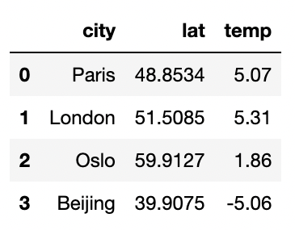

Point out that the remaining code is basic Matplotlib. Simply call `scatter()` on the DataFrame to create a scatter plot of the temperatures versus the latitudes, as captured in the following code and visualization plot:

  ```python
  # Build a scatter plot for each data type
  plt.scatter(weather_data["lat"], weather_data["temp"], marker="o")

  # Incorporate the other graph properties
  plt.title("Temperature in World Cities")
  plt.ylabel("Temperature (Celsius)")
  plt.xlabel("Latitude")
  plt.grid(True)

  # Save the figure
  plt.savefig("TemperatureInWorldCities.png")

  # Show plot
  plt.show()
  ```

  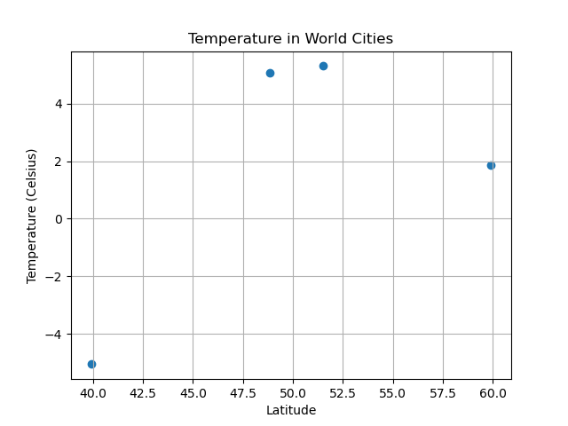

---

### 9. Students Do: TV Ratings DataFrame (10 min)

**Corresponding Activity:** [06-Stu_TVRatingsDataFrame](Activities/06-Stu_TVRatingsDataFrame)

The class will now create an application that reads in a list of TV shows, makes multiple requests from an API to retrieve rating information, creates a Pandas DataFrame, and then visually displays the data.

Open the slideshow to display the instructions and discuss the sample output, which is captured in the following image:

  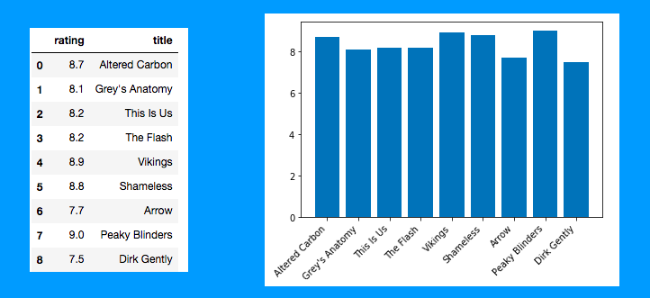

Before students complete [TV_ratings.ipynb](Activities/06-Stu_TVRatingsDataFrame/Unsolved/TV_ratings.ipynb), explain that they will be using the [TVmaze API Show Search Endpoint](https://www.tvmaze.com/api#show-search) to iterate through a list of TV shows.

---

### 10. Review: TV ratings (5 min)

Open up [TV_ratings_solution.ipynb](Activities/06-Stu_TVRatingsDataFrame/Solved/TV_ratings_solution.ipynb) with Jupyter Notebook, and go through the code with the class line by line. Make sure to discuss the following points:

* Ask students how data was isolated from each response and loaded into a Pandas DataFrame.

* For students who made their own list of TV shows, ask if any requests failed to return results and consequently caused an error. This discussion might be a nice lead-in to the activity on exception handling.

* Review how to create a bar chart using the Pandas `plot()` function.

```python
# list of TV show titles to query
tv_shows = ["Altered Carbon", "Grey's Anatomy", "This is Us", "The Flash",
            "Vikings", "Shameless", "Arrow", "Peaky Blinders", "Dirk Gently"]

# TV Maze show search base URL
base_url = "http://api.tvmaze.com/search/shows?q="

# set up lists to hold response data for name and rating
titles = []
ratings = []

# loop through TV show titles, make requests and parse
for show in tv_shows:
    target_url = base_url + show
    response = requests.get(target_url).json()
    titles.append(response[0]['show']['name'])
    ratings.append(response[0]['show']['rating']['average'])

# Create DataFrame
shows_df = pd.DataFrame({
    "title": titles,
    "rating": ratings
})

shows_df

# Plot the data
shows_df.plot('title', 'rating', kind='bar', figsize=(10,5), rot=45)
```

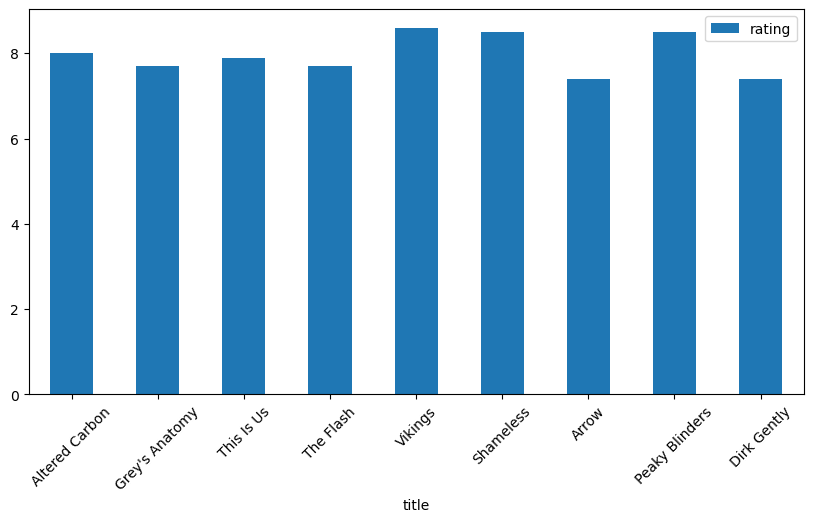

---

### 11. Students Do: Weather Statistics (15 min)

**Corresponding Activity:** [07-Stu_Weather_Stats](Activities/07-Stu_Weather_Stats)

The class will now predict the temperature of a city using a regression model on a dataset from the OpenWeatherMap API.

Open the slideshow to display the instructions.

---

### 12. Review: Weather Statistics (5 min)

Open the following solution file: [weather_stats_solution.ipynb](Activities/07-Stu_Weather_Stats/Solved/weather_stats_solution.ipynb)

Go over the solved code, explaining that the code used to place the API call and create the DataFrame:

  ```python
  cities = ["Paris", "London", "Oslo", "Beijing", "Mumbai", "Manila", "New York", "Seattle", "Dallas", "Taiwan"]

  # set up lists to hold response info
  lat = []
  temp = []

  # Loop through the list of cities and perform a request for data on each
  for city in cities:
      response = requests.get(query_url + city).json()
      lat.append(response['coord']['lat'])
      temp.append(response['main']['temp'])

  print(f"The latitude information received is: {lat}")
  print(f"The temperature information received is: {temp}")
  ```

  ```python
  # Create a DataFrame from cities, lat, and temp
  weather_dict = {
      "city": cities,
      "lat": lat,
      "temp": temp
  }
  weather_data = pd.DataFrame(weather_dict)
  weather_data
  ```

Next, explain how to create a scatter plot from the data, covering the following points:

* `weather_data['lat']` stores the _x_ values, while `weather_data['tmp']` stores the _y_ values.

* A scatter plot is created based on those values.

After creating the scatter plot, explain to students that they will need to perform linear regression and plot the line. Make sure to cover the following points:

* The SciPy stats library is used to perform linear regression and get the `slope`, `intercept`, `rvalue`, `pvalue`, and `stderr`.

  ```python
  # Perform a linear regression on latitude vs. temperature
  (slope, intercept, rvalue, pvalue, stderr) = stats.linregress(x_values, y_values)

  # Get regression values
  regress_values = x_values * slope + intercept
  print(regress_values)
  ```

* A line equation using the resulting values is created.

* A new scatter plot is created, this time with a regression line.

  ```python
  # Create Plot
  plt.scatter(x_values,y_values)
  plt.plot(x_values,regress_values,"r-")

  # Label plot and annotate the line equation
  plt.xlabel('Latitude')
  plt.ylabel('Temperature')
  plt.annotate(line_eq,(20,5),fontsize=15,color="red")

  # Print r-value
  print(f"The r-value is: {rvalue}")

  # Show plot
  plt.show()
  ```

  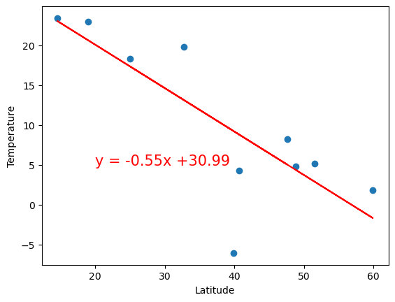

Now that we have an equation for linear regression, temperature for Florence can be predicted.

* Explain that the latitude of Florence can be plugged into the regression line to predict the city's temperature:

  ```python
  # Calculate the temperature for Florence at 34.8
  florence_lat = 34.8
  florence_predicted_temp = round(vc_slope * florence_lat + vc_int,2)

  print(f"The Predicted temperature for Florence will be {florence_predicted_temp}.")
  ```

* Finally, a call is made to the API to determine the actual current temperature.

---

### 13. BREAK (15 min)

---

### 14. Instructor Do: Exception Handling (5 min)

**Corresponding Activity:** [08-Ins_ExceptionHandling](Activities/08-Ins_ExceptionHandling)

Open the slideshow to accompany the beginning of this demonstration.

Point out that the OpenWeatherMap API is robust enough that it responded with every piece of information, and there were no missing values.

* However, not every API is as solid as the OpenWeatherMap API, and sometimes responses will not contain all of the requested data.

Ask a student to explain what would happen if an application tried to look up a key that doesn’t exist within a dictionary.

* If a simple key lookup is performed, such as `data["temp"]`, and the `"temp"` key doesn't exist, Python will throw an exception and terminate the program.

Explain that this behavior makes sense in a basic application or script because the program may have incorrect or missing inputs.

* However, when it comes to databases and API requests, missing values are very common. In these cases, our applications and scripts that use API calls are at risk of terminating prematurely.

Point out that it does not make sense for an application to terminate itself just because a dictionary key doesn't exist. It would be much better to simply deal with the error than crash the app.

* Dealing with these kinds of errors is called exception handling, and, thankfully, Python has built-in tools to resolve these errors.

Open [exception_example.ipynb](Activities/08-Ins_ExceptionHandling/Solved/exception_example.ipynb) within Jupyter Notebook, and explain how an exception error can be created.

* Point out that the `students` dictionary does not have a key for `"Mary"`. When the application tries to print `students["Mary"]`, Python will complain that the key doesn't exist.

* Run the code within the notebook to demonstrate the error, as captured in the following image:

    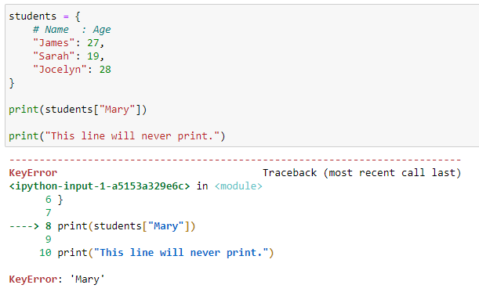

Open [exception_handling_solution.ipynb](Activities/08-Ins_ExceptionHandling/Solved/exception_handling_solution.ipynb) within Jupyter Notebook, and explain how to handle exception errors.

* Before discussing the code in detail, simply point out the `try` and `except` keywords to the class. Briefly explain that these keywords let the application recover from errors like the one that killed the program before.

* Run the file to demonstrate that the final print statement still executes even though the `students["Mary"]` line throws an exception, as captured in the following code:

  ```python
  # Try to access key that doesn't exist
  try:
      students["Mary"]
  except KeyError:
      print("Oops, that key doesn't exist.")
  ```

* Explain that `try` and `except` statements, like `for` and `if` statements, create new indented blocks.

* Python will try to run code in the `try` block, but if an exception arises, Python will then run the code inside the `except` block, as captured in the following image:

  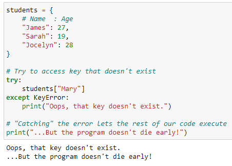

Take a moment to emphasize how powerful this is: try-except blocks allow programmers to anticipate and recover from errors.

Although optional, it is generally considered best practice to specify the precise errors to handle.

* In cases where the programmer wants to handle a particular error in a particular fashion, specifying the exception type is considered best practice.

* In cases where a programmer wants to intercept any error&mdash;like for logging purposes&mdash;it is fine to catch a general exception.

Students will know what exceptions to handle because the name of the exception that killed the program will be printed to the command line.

---

### 15. Students Do: Making Exceptions (5 min)

**Corresponding Activity:** [09-Stu_MakingExceptions](Activities/09-Stu_MakingExceptions)

Students will create an application that uses `try` and `except` to resolve a number of errors.

Open the slideshow to display the instructions.

Explain that students will need to get the final line of the script to print, as captured in the following text block, without changing the problem code in the file.

  ```text
  Whoops. Can't do that.
  Oh, I forgot to define 'name'. D'oh.
  Drat. 'Gabriel' isn't a number?
  I made it through the gauntlet. The message survived!
  ```

---

### 16. Review: Making Exceptions (5 min)

Open [making_exceptions_solution.ipynb](Activities/09-Stu_MakingExceptions/Solved/making_exceptions_solution.ipynb) with Jupyter Notebook, and go through the code with the class line by line. If there is enough time, wrap each "problem line" within the appropriate try-except block live to demonstrate the workflow for identifying which exceptions to use in the `except` clause.

Discuss the following points:

* All the `print` statements are placed under `try` blocks.

* Specific error types are placed in the `except` block.

* A `print` statement is added to log when an error occurs.

* This allows programmers to log certain errors if they occurred, as captured in the following code:

  ```python
  # Your assignment is to get the last line to print without changing any
  # of the code below. Instead, wrap each line that throws an error in a
  # try/except block.

  try:
      print("Infinity looks like + " + str(10 / 0) + ".")
  except ZeroDivisionError:
      print("Whoops. Can't do that.")

  try:
      print("I think her name was + " + name + "?")
  except NameError:
      print("Oh, I forgot to define 'name'. D'oh.")

  try:
      print("Your name is a nonsense number. Look: " + int("Gabriel"))
  except ValueError:
      print("Drat. 'Gabriel' isn't a number?")

  print("I made it through the gauntlet. The message survived!")
  ```

Explain that it is good practice to wrap dictionary accesses to responses from API calls in try-except blocks, just in case all responses do not have the desired key.

---

### 17. Student Do: API Call Exceptions (15 min)

**Corresponding Activity:** [10-Stu_API_Exceptions](Activities/10-Stu_API_Exceptions)

In this activity, students will implement try-except blocks as they make API calls to narrow down a list of fictional characters to include only characters from Star Wars.

Open the slideshow to display the instructions.

---

### 18. Review: API Call Exceptions (5 min)

Open [api_exceptions_solution.ipnyb](Activities/10-Stu_API_Exceptions/Solved/api_exceptions_solution.ipynb) in a notebook, send the file to students, and discuss the following steps as go through the code:

* Loop through each character in the list.

* Make an API call for each character by appending the character to the URL:

  ```python
  # Create search query, make request and store in json
  query = url + character
  response = requests.get(query)
  response_json = response.json()
  ```

* Use `try` to attempt to retrieve the height and mass of the character:

  ```python
    try:
        height.append(response_json['results'][0]['height'])
        mass.append(response_json['results'][0]['mass'])
        starwars_characters.append(character)
        print(f"{character} found! Appending stats")
  ```

* Use `except` to `pass` on characters that would return an error because they do not exist in the Star Wars Universe:

  ```python
  # Handle exceptions for characters not available in the Star Wars API
      except:
          # Append null values
          print("Character not found")
          pass
  ```

* Store the results in a DataFrame.

---

### 19. Instructor Do: World Bank API (5 min)

**Corresponding Activity:** [11-Ins_WorldBankAPI](Activities/11-Ins_WorldBankAPI)

Open the slideshow to accompany the beginning of this demonstration.

Explain that the next few activities will serve to further familiarize students with using APIs and reading complex documentation.

Navigate to the [World Bank API](https://datahelpdesk.worldbank.org/knowledgebase/topics/125589-developer-information) website, and explain that the World Bank API provides data on a variety of topics, including lending types, income levels, and much more.

Open the [Basic Call Structure](https://datahelpdesk.worldbank.org/knowledgebase/articles/898581-api-basic-call-structure) link, and explain the documentation's notes on argument-based vs URL-based queries, as captured in the following image:

  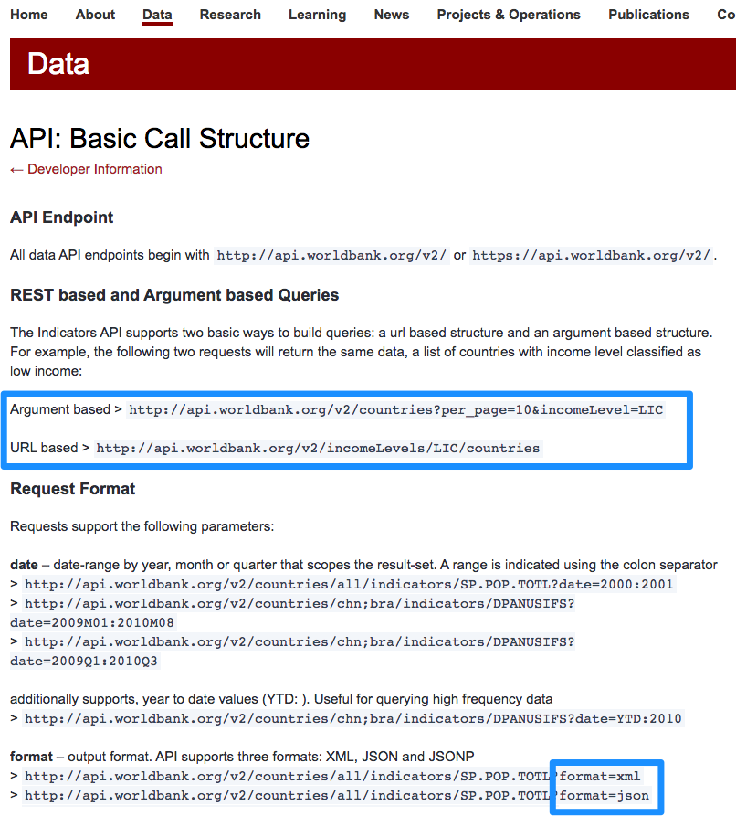

* Argument-based query strings are what the class has been working with so far today, while REST-based API calls are more like those that students used during the first class.  Argument-based queries are far more common than URL-based queries.

Open [world_bank_api_solution.ipynb](Activities/11-Ins_WorldBankAPI/Solved/world_bank_api_solution.ipynb) within Jupyter Notebook, and run the code once before discussing the application with students line by line.

* Since there is no wrapper installed for this API, the class will need to interface with it directly, as captured in the following code:

  ```python
  url = "http://api.worldbank.org/v2/"
  api_format = "json"

  # Get country information in JSON format
  countries_response = requests.get(f"{url}countries?format={api_format}").json()
  ```

Navigate back to the [top-level documentation page](https://datahelpdesk.worldbank.org/knowledgebase/topics/125589-developer-information), and explain that the other links contain similar documentation for more specific query types.

---

### 20. Partners Do: Two Calls (10 min)

**Corresponding Activity:** [12-Stu_TwoCalls](Activities/12-Stu_TwoCalls)

For this activity, students will use the World Bank API to make two API calls in sequence. The second API call depends on the response from the first.

Before sending students the instructions for `two_calls.ipynb`, display and discuss the following output to help them understand what they will be creating.

  ```text
  The number of countries with lending type IBD is 140.
  The number of countries with lending type IDB is 30.
  The number of countries with lending type IDX is 118.
  The number of countries with lending type LNX is 74.
  ```

Open the slideshow to display the instructions and sample output.

---

### 21. Review: Two Calls (5 min)

Open up [two_calls_solution.ipynb](Activities/12-Stu_TwoCalls/Solved/two_calls_solution.ipynb) within Jupyter Notebook, and go through the code with the class line by line by having the students describe the application.

* Ask a student to explain how they retrieved the list of lending types.

* Ask a student to explain how they got a count of the countries for each lending type on record.

---

© 2022 edX Boot Camps LLC. Confidential and Proprietary. All Rights Reserved.
