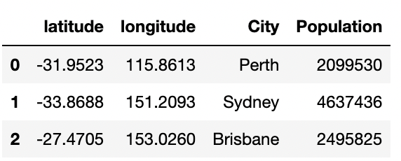

## 6.3 APIs and Geospatial Data Visualization

### Overview

In this class, the students will be introduced to the Geoapify API and the GeoViews Python library. Using these new tools, along with data from the U.S. Census, students will be tasked with creating visualizations to capture the socioeconomic trend of [banking deserts](http://www.theatlantic.com/business/archive/2016/03/banking-desert-ny-fed/473436/).

### Class Objectives

By the end of this lesson, the students will be able to:

* Use the Geoapifi API to obtain information about geographic areas.

* Use the Census API wrapper.

* Explain the concept of rate limits and the importance of creating test cases before running large scripts.

* Dissect new API documentation.

* Visually represent data on a map with the GeoViews Python library.

---

### Instructor Notes

* Today's class is a fun one! In this class, students will take on the role of social scientists. They’ll be tasked with using their newfound programming skills and API insights to visualize a real-world phenomenon: banking deserts.

* What _is_ a banking desert? In predominantly lower-income or elderly neighborhoods, there is often a dearth of banks. Often, high-interest "check-cashing" and "money transfer" providers are in their place. These shifty providers benefit from the fact that banks avoid such neighborhoods, leaving residents with few safe options to obtain cash, loans, or withdrawal services. To showcase this trend, students will use a dataset from the U.S. Census that lists the socioeconomic factors (population, median age, household income, poverty rate, etc.) of each zip code in the country. They will then need to create a code that randomly selects 700 zip codes and uses the Geoapify API to identify the number of banks within an 8-km radius of that zip code. Finally, they will plot the relationship between "bank count" and socioeconomic factors.

* Leading up to this exercise, you will be teaching students how to use the Geoapify API. Today's class is also important because this API will be a useful tool for students in upcoming projects.

* Make sure you and your students install the required libraries for this module in your `dev` environment before class. To install these libraries, activate your virtual environment, then run:

  ```shell
  conda install -c pyviz hvplot geoviews
  pip install census
  pip install citipy # not needed for the class but needed for the challenge
  ```

  To make sure these libraries installed properly, run:

    ```shell
    conda list hvplot
    conda list geoviews
    ```

  If you do not see anything listed when you check the `geoviews` library, you may try an alternative install option. Run the following:

    ```shell
    conda install -c conda-forge geoviews
    ```

* **Note:** The API keys used throughout this lesson have been disabled and will have to be replaced with active keys.

---

### Class Slides

* The slides for this lesson can be viewed on Google Drive here: [Lesson 6.3 Slides](https://docs.google.com/presentation/d/1gDs1jg8tOWEZnltwhitPRZpF6ScJOU0uyt9jKpqvjro/edit?usp=sharing).

* To add the slides to the student-facing repository, download the slides as a PDF by navigating to File, selecting "Download as," and then choosing "PDF document." Then, add the PDF file to your class repository along with other necessary files. You can view instructions for this [here](https://docs.google.com/document/d/1XM90c4s9XjwZHjdUlwEMcv2iXcO_yRGx5p2iLZ3BGNI/edit).

* **Note:** Editing access is not available for this document. If you wish to modify the slides, create a copy by navigating to File and selecting "Make a copy...".

---

### Time Tracker

| Start Time | Number | Activity                                           | Duration |
| ---------- | ------ | -------------------------------------------------- | -------- |
| 6:30 PM    | 1      | Everyone Do: Setting Up the Geoapify API Key       | 0:15     |
| 6:45 PM    | 2      | Instructor Do: Geoapify Geocode                    | 0:15     |
| 7:00 PM    | 3      | Instructor Do: Geoapify Places                     | 0:15     |
| 7:15 PM    | 4      | Students Do: Geoapify Drills                       | 0:20     |
| 7:35 PM    | 5      | Review: Geoapify Drills                            | 0:10     |
| 7:45 PM    | 6      | Instructor Do: Exploring Nearest Restaurants in Madrid | 0:15     |
| 8:00 PM    | 7      | BREAK                                              | 0:15     |
| 8:15 PM    | 8      | Everyone Do: Exploring Airports in Australia       | 0:10     |
| 8:25 PM    | 9      | Everyone Do: GeoViews Maps                         | 0:15     |
| 8:40 PM    | 10     | Student Do: Australian Airports Map                | 0:10     |
| 8:50 PM    | 11     | Review: Australian Airports Map                    | 0:10     |
| 9:00 PM    | 12     | Instructor Do: U.S. Census Demo                    | 0:10     |
| 9:10 PM    | 13     | Everyone Do: Banking Deserts                       | 0:20     |
| 9:30 PM    |        | END                                                |          |

---

### 1. Everyone Do: Setting Up the Geoapify API Key (15 min)

Open the slideshow to cover today's class objectives.

Explain to the students that they will work with the Geoapify API for the rest of today’s class. Let them know that this section is critical and may confuse them if they lose track or attention.

Begin your discussion by opening the URL for [Geoapify](https://www.geoapify.com/) and then cover the following points:

* Geoapify is a localization platform that uses open data to allow developers to create maps, route optimization, and location intelligence applications.

* Geoapify is mainly powered by data from [OpenStreetMap](https://www.openstreetmap.org/), a community-driven platform where people all around the world contribute with map data.

* Geoapify provided an API that allows developers to quickly convert locations into latitude and longitude coordinates, identify the nearest restaurants to a given location, determine the distance between two points, and so much more!

* The Geoapify API is free to use and no credit card is required to signup for an API key.

* Tech companies, such as Microsoft or Google, also offer mapping APIs, you may find that the skills you'll learn today are also applicable to using other mapping APIs.

* Ultimately, for today's class, you'll be using the data from Geoapify to determine the number of banks in a given zip code and then compare those counts to socioeconomic factors associated with the zip code.

Next, guide students through the steps to obtain their API key.

Start by opening the [Geoapify website](https://www.geoapify.com/).

Next, click on the "LOG IN / SIGN UP" button.

  

On the "Sign in" page, you can either register a new account or sign in with Google or Facebook.

> **Note:** Allow students to choose the registration method of their preference. Wait until all students have created an account.

After registering an account, the next step is to create a project. To do so, click on the "Add a new project" button.

  

Once you clicked on the "Add a new project" button, you'll see a prompt to set a project's name. For this demo type "Data-Bootcamp-Demo" and click on the "OK" button to continue.

Next, you will see the project's page. To see your API key, click on the "API keys" item in the left menu.

  

Explain to the students that they can use this API free of charge to make up to 3,000 API calls. Share out [the API documentation page](https://apidocs.geoapify.com/) and encourage them to save it for further reference.

Be sure that all the students were able to generate their API keys. Answer any questions before moving in.

---

### 2. Instructor Do: Geoapify Geocode (15 min)

**Corresponding Activity:** [01-Ins_Geoapify_Geocode](Activities/01-Ins_Geoapify_Geocode)

Open the slideshow to accompany the beginning of this demonstration.

* Now that everyone has an API key (Congratulations!), it’s time to start using it!

To begin, guide students through the process of using the Geoapify API to turn addresses into latitude and longitude coordinates.

* This process of converting an address to coordinates is called **geocoding**.

* Since many APIs only understand locations formatted in terms of latitude and longitude, geocoding will be very valuable when translating addresses into data that APIs can understand.

At this point, either open [geocode_solution.ipynb](Activities/01-Ins_Geoapify_Geocode/Solved/geocode_solution.ipynb) in Jupyter Notebook and explain the code in sequence, or live-code the script.

* Use the API key from `config.py`.

    * Geoapify's API is personal; please stress again that students should avoid pushing their API key to GitHub by adding the `config.py` to their `.gitignore` file or using environment variables.

* Next, build the endpoint URL.

    * Remind students that printing the URL will also expose their key. Although it is useful for demonstration purposes here, it should be avoided in projects and homework.

* Run a Python request on the URL.

* Explore the resulting JSON in a pretty-printed format.

* Extract the desired components of the JSON.

* Format the results for printing.

    * Note that we can use f-strings to create our target URL, as annotated in the following image:

    

Next, take a moment to visit the [Geoapify API Geocoding](https://apidocs.geoapify.com/playground/geocoding) playground page, and explain to students that the code created is similar to what's presented on this page.

  

Also, share out the [Geoapify API Geocoding](https://apidocs.geoapify.com/docs/geocoding/forward-geocoding/#about) documentation page. Let them know that it's easy to be intimidated by code documentation, and each bit of practice will make it easier in the future.

---

### 3. Instructor Do: Geoapify Places (15 min)

**Corresponding Activity:** [02-Ins_Geoapify_Places](Activities/02-Ins_Geoapify_Places)

Open the slideshow to accompany the beginning of this demonstration.

Open the [Geoapify API Places documentation](https://apidocs.geoapify.com/docs/places/#about) and guide students through the documentation for a few minutes.

The points to emphasize are the following:

* [API reference](https://apidocs.geoapify.com/docs/places/#api), where they can learn how they can configure the request URL parameters.

* [Supported categories](https://apidocs.geoapify.com/docs/places/#categories), where they can learn the hierarchy used to categorize the different types of places.

* [Supported conditions](https://apidocs.geoapify.com/docs/places/#conditions), where they can review the amenities that a place can offer to refine a place search.

* Finally, the [URL examples](https://apidocs.geoapify.com/docs/places/#url-examples) section provides sample URL search requests.

* Each search type has expected inputs, such as latitude, longitude, and radius. Additionally, there are various optional parameters, including filters, categories, and conditions.

Once students feel comfortable with the API, open up [places_solution.ipynb](Activities/02-Ins_Geoapify_Places/Solved/places_solution.ipynb) in Jupyter Notebook, and explain the code.

* For the most part, the code is similar to the earlier example; however, the base URL has changed since the class is now using the Geoapify API places search.

* In this example, we use a feature of the [Requests library](https://requests.readthedocs.io/en/latest/user/quickstart/#passing-parameters-in-urls) to easily construct our URL by passing in a dictionary of parameters.

* During the discussion of this example, point out the various URL parameters like `categories`, `conditions`, `filter`, and `bias`. Also, point out the different JSON structures provided to the user.

You can learn more about the parameters in the API documentation; for this demo, highlight the following:

* The places search API requires the geographical coordinates of the point of interest to look for particular places nearby.

* Setting the `filter` parameter equal to `circle` we can define a circular area with a particular radius to search for places of interest.

* For this demonstration, we are setting a circle search area with a radius of 8,000 meters (8 km).

* As you can see in the API documentation, the `bias` parameter allows prioritizing places near the location inside the circle area.

For demonstration purposes only, print the response URL and explore its formation with the class. Be aware of not publishing your API key in a public repo.

Review the JSON structure, and end this demo by printing the name and address of the first restaurant.

---

### 4. Students Do: Geoapify Drills (20 min)

**Corresponding Activity:** [03-Stu_Geoapify_Drills](Activities/03-Stu_Geoapify_Drills)

The class will now create code that makes calls to both the Geoapify API places and geocoding endpoints.

Open the starter file for [geoapify_drills.ipynb](Activities/03-Stu_Geoapify_Drills/Unsolved/geoapify_drills.ipynb) in Jupyter Notebook, and explain the instructions to students.

You may open the slideshow to display the activity's instructions.

---

### 5. Review: Geoapify Drills (10 min)

Open [geoapify_drills_solution.ipynb](Activities/03-Stu_Geoapify_Drills/Solved/geoapify_drills_solution.ipynb) within Jupyter Notebook, send out the file to students, and go through the code with the class line by line. Make sure to hit upon the following points:

For the most part, the solutions to these drills are self-explanatory.

Read the API documentation if you have any questions.

---

### 6. Instructor Do: Exploring Nearest Restaurants in Madrid (15 min)

**Corresponding Activity:** [04-Ins_Nearest-Restaurants](Activities/04-Ins_Nearest-Restaurants)

Open the slideshow to accompany the beginning of this demonstration.

Remind students that last class, we learned how to make multiple queries and handle missing data using try-except and list comprehension.

* Another way to build out an API dataset is to use Pandas.

Explain to the students that for this demo, we'll suppose that we are visiting Madrid, Spain. After a long walk, we are at Plaza Mayor, the main square of the Spanish capital city. We are hungry and we are curious about the different types of restaurants no more than 1km from Plaza Mayor.

Point out that we'll use Geoapify and Pandas to find the nearest restaurants.

Explain that we can use Pandas's `iterrows()` and `.loc` methods to find the closest restaurant of each type and store the results in a DataFrame.

Point out that just as we did last class, we will need to encapsulate our parsing logic using try-except blocks to allow for the API queries to continue when there are missing values.

Open [restaurants_solution.ipynb](Activities/04-Ins_Nearest-Restaurants/Solved/restaurants_solution.ipynb), and explain the code to students while highlighting the following points:

* We have a CSV file that contains the different ethnicity types of restaurants that we can search using Geoapify.

* After loading the CVS file into a DataFrame, we set up empty columns to hold values retrieved from API, as captured in the following image.

  

* `iterrows()` iterates through each row of the DataFrame, returning an index number and the contents of each row. Those row values can then be individually accessed using the column label, as in `row["column label"]`.

  ```python
  # use iterrows to iterate through pandas DataFrame
  for index, row in types_df.iterrows():
  ```

* In each iteration, the `ethnicity` value is overwritten to be the new target:

  ```python
  # Get the ethnicity type from the current DataFrame's row
  ethnicity = types_df.loc[index, "ethnicity"]
  # Add the current ethnicity type to the parameters
  params["categories"] = f"catering.restaurant.{ethnicity}"
  ```

* To retrieve `restaurant`, if it exists, we use `requests.get`. This works by sending a get request to the API by passing in the `base_url` and an optional parameter, `params`. This `params` parameter will then take the dictionary and send it to the query string for the request. The result of the request is then converted to JSON.

  ```python
  # Make and API request using the params dictionary
  restaurant = requests.get(base_url, params=params)

  # Convert the API response to JSON format
  restaurant = restaurant.json()
  ```

* We use a try-except block to attempt to retrieve the `name`, `address`, and `distance` from the API request results. If the results don't contain any of these values, a KeyError or IndexError will occur and trigger the except clause to run, allowing the code to keep running.

* If no error occurs, then `.loc` is used to update the cells with the desired information from the results:

  ```python
  try:
      types_df.loc[index, "name"] = restaurant["features"][0]["properties"]["name"]
      types_df.loc[index, "address"] = restaurant["features"][0]["properties"]["address_line2"]
      types_df.loc[index, "distance"] = int(restaurant["features"][0]["properties"]["distance"])
  except (KeyError, IndexError):
      # If no restaurant is found, set the restaurant name as "No restaurant found".
      types_df.loc[index, "name"] = "No restaurant found"
      # Set the distance column value to np.nan to allow sorting values
      types_df.loc[index, "distance"] = np.nan
  ```

Data Source: Data generated by 2U, Inc. using the Geoapify API is intended for educational purposes only.

---

### 7. BREAK (15 min)

---

### 8. Everyone Do: Exploring Airports in Australia (10 min)

**Corresponding Activity:** [05-Evr_Exploring_Airports](Activities/05-Evr_Exploring_Airports)

Use the Review section as guidance for talking points as you live-code along with the students.

Take your time, and answer all student questions along the way.

Open [airports.ipynb](Activities/05-Evr_Exploring_Airports/Unsolved/airports.ipynb) within Jupyter Notebook, and use [airports_solution.ipynb](Activities/05-Evr_Exploring_Airports/Solved/airports_solution.ipynb) as a guide as you go through the code with the class line by line, making sure to hit upon the following points:

* `iterrows()` is used to loop through each city in the DataFrame to obtain the coordinates for each airport.

* `.loc` sets the value of the latitude and longitude columns to match the retrieved coordinates provided by the Geoapify Geocoder API, as captured in the following images of the code and resulting DataFrame:

  ```python
  # Define the API parameters
  params = {
      "apiKey":geoapify_key,
      "format":"json"
  }

  # Set the base URL
  base_url = "https://api.geoapify.com/v1/geocode/search"

  # Print a message to follow up on the airport search
  print("Starting airport search")

  # Loop through the cities_pd DataFrame and search coordinates for each city
  for index, row in cities_pd.iterrows():

      # Get the city's name & add ", Australia" to the string so geoapify finds the correct city
      city = row["City"] + ", Australia"

      # Add the current city to the parameters
      params["text"] = f"{city}"

      # Make the API request
      response = requests.get(base_url, params=params)

      # Convert response to JSON
      response = response.json()

      # Extract latitude and longitude
      cities_pd.loc[index, "Lat"] = response["results"][0]["lat"]
      cities_pd.loc[index, "Lon"] = response["results"][0]["lon"]

      # Log the search results
      print(f"Coordinates for {city} fetched...")

  # Display sample data to confirm that the coordinates appear
  cities_pd.head()
  ```

  

The iteration is repeated a second time, using the newfound latitudes and longitudes to obtain airport information with Geoapify Places, as captured in the following code and image of the DataFrame output:

Point out that the application uses a try-except block to avoid situations where Geoapify Places is missing  information, as captured in the following image:

  ```python
  # Set parameters to search for airport details
  radius = 50000
  params = {
      "categories":"airport",
      "apiKey": geoapify_key,
      "limit":20
  }

  # Print a message to follow up on the airport search
  print("Starting airport details search")

  # Iterate through the types_df DataFrame
  for index, row in cities_pd.iterrows():

      # Get the city's name
      city = row["City"]

      # Get latitude, and longitude from the DataFrame
      latitude = row["Lat"]
      longitude = row["Lon"]

      # Add the current city's latitude and longitude to the params dictionary
      params["filter"] = f"circle:{longitude},{latitude},{radius}"
      params["bias"] = f"proximity:{longitude},{latitude}"

      # Set base URL
      base_url = "https://api.geoapify.com/v2/places"

      # Make an API request using the params dictionary
      response = requests.get(base_url, params=params)

      # Convert the API response to JSON format
      response = response.json()

      # Grab the first airport from the results and store the details in the DataFrame
      try:
          cities_pd.loc[index, "Airport Name"] = response["features"][0]["properties"]["name"]
          cities_pd.loc[index, "IATA Name"] = response["features"][0]["properties"]["datasource"]["raw"]["iata"]
          cities_pd.loc[index, "Airport Address"] = response["features"][0]["properties"]["address_line2"]
          cities_pd.loc[index, "Distance"] = response["features"][0]["properties"]["distance"]
          cities_pd.loc[index, "Website"] = response["features"][0]["properties"]["datasource"]["raw"]["website"]
      except KeyError as e:
          # If no airport is found, log the error.
          print(f"{e.args[0]} not found for {cities_pd.loc[index, 'Airport Name']}")

      # Log the search results
      print(f"nearest airport from {city}: {cities_pd.loc[index, 'Airport Name']}")

  # Display sample data
  cities_pd
  ```

  

---

### 9. Everyone Do: GeoViews Maps (15 min)

**Corresponding Activity:** [06-Evr_Geoviews_Maps](Activities/06-Evr_Geoviews_Maps)

Open the slideshow to accompany the beginning of this demonstration.

**Note:** You should use Jupiter Lab version 3.0 or later. If you are having trouble displaying the maps, review [the installation instructions in the GeoViews docs](https://geoviews.org/#installation), and then retry.

Explain to the students the use case for [GeoViews](https://geoviews.org/). While discussing GeoViews, make sure to explain the following points:

* **GeoViews** is a Python library that allows users to embed maps directly into their notebooks.

* This enables users to visualize location data and customize the map's appearance.

* To use this library, we need to install it in our virtual environment.

If students did not install GeoViews prior to class, they should run the following command from their `dev` environment in terminal/Anaconda prompt.

* **Note:** The Jupyter notebook server may need to be restarted for the changes to take place.

  ```shell
  conda install -c pyviz hvplot geoviews
  ```

Explain to the students that installing GeoViews in their `dev` environment will install all the dependencies they need for the class activities.

Before proceeding to the demonstration, address questions and troubleshoot any installation issues.

Once all students have GeoViews installed, send out the notebook file [geoviews_demo.ipynb](Activities/06-Evr_Geoviews_Maps/Unsolved/geoviews_demo.ipynb). Live code, explaining the following along the way:

* First, we need to import `pandas` and the `hvplot.pandas` libraries.

  ```python
  # Import the required libraries
  import hvplot.pandas
  import pandas as pd
  ```

* Point out that GeoViews is built on HoloViews (imported as `hvplot`). We are not fully covering the HoloViews library, but it's important to highlight that `hvPlot` adds additional plotting capabilities to Pandas DataFrames, similar to matplotlib, we can create plots by using the `hvPlot` builtin methods that are added to DataFrames when you install this library.

* That's why we imported Pandas as well as the `hvplot.pandas` library. For the scope of this class, we will focus only on creating maps using GeoViews, but you are encouraged to read more about HoloViews and GeoViews on their documentation pages.

    * **Note:** Share out the [HoloViews](https://holoviews.org/) and [GeoViews](https://geoviews.org/) documentation pages for further reference.

* Sometimes, by using HoloViews and GeoViews you may get several warnings, so we will turn off warnings in our notebook by importing the `warning` library and setting the `filterwarnings` function to `ignore`.

  ```python
  # Turn off warning messages
  import warnings
  warnings.filterwarnings("ignore")
  ```

* To create a map plot using GeoViews, we need a DataFrame containing geographical coordinates. For this demo, we will create a DataFrame with the location of three Australian cities and their population according to the ["List of cities in Australia by population" page in Wikipedia](https://en.wikipedia.org/wiki/List_of_cities_in_Australia_by_population).

  ```python
  # Create a dictionary containing coordinates
  coordinates = {
      "latitude": [-31.9523, -33.8688, -27.4705],
      "longitude": [115.8613, 151.2093, 153.0260],
      "City": ["Perth", "Sydney", "Brisbane"],
      "Population": [2099530, 4637436, 2495825]
  }

  # Create a Pandas DataFrame containing coordinates
  coordinates_df = pd.DataFrame(coordinates)

  # Display sample data
  coordinates_df
  ```

  

* Let's start by creating a simple map using GeoViews. To do so, we will use the DataFrame we created and the `hvplot.points` function that was added after installing HoloViews and GeoViews.

* To create a simple map, we need to specify the DataFrame's column that contains the longitude, followed by the column containing the latitude. Next, we need to set the parameter `geo = True` to allow GeoViews to display a map visualization. Finally, we need to define the type of map (tile) we want to use by setting a value to the `tiles` parameter. For this example, we will set `titles = "OSM"` to use the OpenStreetMap mapping style.

  ```python
  # Configure the map plot_1
  map_plot_1 = coordinates_df.hvplot.points(
      "longitude",
      "latitude",
      geo = True,
      tiles = "OSM"
  )
  ```

* Note that we store the map plot into a variable called `map_plot_1`. To display the map, we simply type the variable name.

  ```python
  # Display the map plot_1
  map_plot_1
  ```

  

* As you can see, we have a visualization issue with this map. The map doesn't display all the cities accurately and we need to scroll to view the entire map.

* The solution to this visualization issue is to add two additional parameters: `frame_width` and `frame_height` so we can set a default size to display all the points in the map.

* Let's set `frame_width = 700` and `frame_height = 500` to create a second plot.

  ```python
  # Configure the map plot_2
  map_plot_2 = coordinates_df.hvplot.points(
      "longitude",
      "latitude",
      geo = True,
      tiles = "OSM",
      frame_width = 700,
      frame_height = 500
  )

  # Display the map plot
  map_plot_2
  ```

  

* We can customize the points by changing the color and size. Usually, as we may tell a story using our data, we can use data from our DataFrame to add these customizations. Let's use the `City` column to define a different color for each city, and the `Population` column to add point size according to people living in each city. Note that we are also setting `scale = 0.01`; this parameter defines a scale to be applied to the `size` parameter. As we have the population data in terms of millions, without the `scale` parameter we will obtain a gigantic point. Give it a try, and omit the `scale` parameter!

  ```python
  # Configure the map plot_3
  map_plot_3 = coordinates_df.hvplot.points(
      "longitude",
      "latitude",
      geo = True,
      tiles = "OSM",
      frame_width = 700,
      frame_height = 500,
      size = "Population",
      scale = 0.01,
      color = "City"
  )

  # Display the map plot
  map_plot_3
  ```

  

* Note that in this customized map, we have a legend for the map indicating the color of each city. Also, GeoViews provides a great feature, if you place the mouse pointer over a point, you will see a tooltip message showing information details about the point that is contained in the DataFrame.

  

* To finish this demo, let's try a different map tile. We'll use the same code as the previous map but we'll change the `OSM` tile for `EsriNatGeo`. You can see the different tiles available in the GeoViews docs.

  ```python
  # Configure the map plot_4
  map_plot_4 = coordinates_df.hvplot.points(
      "longitude",
      "latitude",
      geo = True,
      tiles = "EsriNatGeo",
      frame_width = 700,
      frame_height = 500,
      size = "Population",
      scale = 0.01,
      color = "City"
  )

  # Display the map plot
  map_plot_4
  ```

  

Share out the ["Tile Source" page](https://geoviews.org/user_guide/Working_with_Bokeh.html#wmts-tile-sources) with the class for further reference. Let the students know that, due to licensing updates, some tiles may be not available.

---

### 10. Student Do: Australian Airports Map (10 min)

**Corresponding Activity:** [07-Stu_Airport_Map](Activities/07-Stu_Airport_Map)

In this activity, students will create a map based on airport information.

You may open the slideshow to display the activity's instructions and sample output.

---

### 11. Review: Australian Airports Map (10 min)

Open [airports_map_solution.ipynb](Activities/07-Stu_Airport_Map/Solved/airports_map_solution.ipynb) in Jupyter Notebook, and explain the following as you progress through the code:

* We start by importing the required libraries using the provided code.

  ```python
  # Import the required libraries
  import hvplot.pandas
  import pandas as pd

  # Turn off warning messages
  import warnings
  warnings.filterwarnings("ignore")
  ```

* Next, we load the Australian airport information we previously created into a Pandas DataFrame.

* Once we have the data in a DataFrame, we can use GeoViews features to create an initial simple map as follows. Note that we are using the `OSM` tile.

  ```python
  # Configure the map
  map_plot_1 = airports_df.hvplot.points(
      "Lon",
      "Lat",
      geo = True,
      tiles = "OSM",
      frame_width = 800,
      frame_height = 600
  )

  # Display the map plot
  map_plot_1
  ```

  

* Finally, to create an enhanced map, we customize the map's configuration as follows. Note that we set `tiles = "EsriImagery"` for demoing purposes, but you can choose any other tile. For setting the points color, we set `color = "City"` and `size = "Distance"` to differentiate each city's airport. As you can see, we set `scale = 0.5` to have a visible point for each airport location.

  ```python
  # Configure the map
  map_plot_2 = airports_df.hvplot.points(
      "Lon",
      "Lat",
      geo = True,
      tiles = "EsriImagery",
      frame_width = 800,
      frame_height = 600,
      size = "Distance",
      scale = 0.5,
      color = "City"
  )

  # Display the map plot
  map_plot_2
  ```

  

---

### 12. Instructor Do: U.S. Census Demo (10 min)

**Corresponding Activity:** [08-Ins_Census](Activities/08-Ins_Census)

Open the slideshow to accompany the beginning of this demonstration.

**Note:** These Census examples are stretch targets. Don’t sweat it If you cannot get to them!

As you transition to the next activity, explain to students that obtaining U.S. Census data is fairly straightforward using the Python library’s Census wrapper.

Point out that most national Statistics Offices worldwide provide an automated way to fetch data, such as APIs or end-points to retrieve data in different formats such as JSON or CSV. Highlight that for this demo, you will focus on the U.S. Census data only, taking advantage of the existing Python library.

Have students visit [Census wrapper](https://github.com/datamade/census), run `pip install census`, and obtain a [Census API key](https://api.census.gov/data/key_signup.html) from the U.S. Census Bureau.

**Note:** It will take 2 to 3 minutes after you enter your information into the form to get your Census API key. To save time if students have issues getting a key, get your key before class and simply provide students with your key.

Once students have everything set up, guide them through the general documentation of the Census wrapper API.

* Essentially, the wrapper provides an easy method of retrieving data from the 2013 Census based on zip code, state, district, or county.

* Each census field (e.g., Poverty Count, Unemployment Count, Number of Asians, etc.) is denoted with a label like B201534_10E. When using the API, developers list each desired field based on their labels.

* The results are then returned as a list of dictionaries, which can be immediately converted into a DataFrame.

* While discussing the API, it's fair to point out to students that the US Census API isn't the best-documented API out there.

Now, open [census_demo_solution.ipynb](Activities/08-Ins_Census/Solved/census_demo_solution.ipynb) using Jupyter. Explain to students that this is the code used to create the CSV in the banking deserts example. In particular, point out the following:

* We used the `c.acs5.get` method to grab data on each of the fields that we needed.

    * **Note:** For ease of use, we’ve provided a gist that defines what field each label in the U.S. Census correlates with.

* The U.S. Census does not explicitly calculate the poverty rate, so we divided the `Poverty Count` by `Total Population` to evaluate the `Poverty Rate`, as annotated in the following image:

  

* Ask if there are any questions before sending out the code and proceeding with the activity.

Data Source: Data for this dataset was generated by edX Boot Camps LLC, and is intended for educational purposes only.

---

### 13. Everyone Do: Banking Deserts (20 min)

**Corresponding Activity:** [09-Evr_Banking_Deserts](Activities/09-Evr_Banking_Deserts)

Explain to students that we'll be creating a data visualization to understand the prominence of the banking desert phenomenon. They will use the U.S. Census and their newfound GeoViews skills to accomplish this.

Send out the article on [banking deserts](https://www.theatlantic.com/business/archive/2016/03/banking-desert-ny-fed/473436/) from The Atlantic. Explain to students that banking deserts are a socioeconomic phenomenon where many lower-income and elderly areas tend to have minimal available banking services. As a result, these communities are often preyed upon by high-interest providers of check-cashing and "fast cash now" services.

Use the Review section as guidance for talking points as you live-code along with the students.

Take your time, and answer all student questions along the way.

Open [banking_deserts.ipynb](Activities/09-Evr_Banking_Deserts/Unsolved/banking_deserts.ipynb) in Jupyter Notebook, using [banking_deserts_solution.ipynb](Activities/09-Evr_Banking_Deserts/Solved/banking_deserts_solution.ipynb) as a guide as you live-code with the students. Along the way, make sure to explain the following points:

* The solution for this activity starts by fetching data from the U.S Census by using the provided labels that are related to population, poverty count, and zip code.

* Next, you're asked to find the `Poverty Rate` by dividing the `Poverty Count` by `Population`. It's important to recall that each column should be converted to an integer.

* We continue by importing the `zip_bank_data.csv` file provided. In this step, we should set `dtype = "object"` and `encoding = "utf-8` to ensure that all data is read accurately.

* Next, we create a new DataFrame called `census_data_complete` by using the Pandas `merge` method to combine the data we fetch from the U.S Census and the data from the `zip_bank_data.csv` file.

  ```python
  # Merge the two data sets along the zip code
  census_data_complete = pd.merge(
      zip_code_pd,
      census_pd,
      how = "left",
      on = ["Zipcode", "Zipcode"]
  )
  ```

* After merging both DataFrames, we use the Pandas `dropna` function to remove any missing data. Also, it's crucial to explicitly set "Lat" (latitude) and "Lng" (longitude) columns to float data type.

  ```python
  # Remove rows with missing data
  census_data_complete = census_data_complete.dropna()

  # Transform latitude and longitude to float
  census_data_complete["Lat"] = census_data_complete["Lat"].astype(float)
  census_data_complete["Lng"] = census_data_complete["Lng"].astype(float)
  ```

* After preparing the data, we can use GeoViews to create a poverty rate map as it's requested. Pay particular attention to how we use the `hover_cols` parameter to pass the "Address" and "Bank Count" columns as a list to display additional data in the tooltip text over each point in the map.

  

Answer any questions on the maps before moving on to the statistics portion of the assignment. Go through the rest of the code, and explain the following:

* The summary statistics can be found by using `mean()`, `median()`, and `mode()`:

  ```python
  # Mean, median, mode for Poverty Rate
  poverty_mean = round(census_data_complete["Poverty Rate"].astype("float").mean(), 2)
  poverty_median = round(census_data_complete["Poverty Rate"].astype("float").median(), 2)
  poverty_mode = round(census_data_complete["Poverty Rate"].astype("float").mode(), 2)

  print(f"Poverty Rate Mean: {poverty_mean}")
  print(f"Poverty Rate Median {poverty_median}")
  print(f"Poverty Rate mode {poverty_mode}")
  ```

* For linear regression and scatter plot, we need to declare the independent (_x_) and dependent (_y_) values. `Poverty Rate` and `Bank Count` are stored as independent and dependent values, respectively.

    * A linear regression model is then generated for these variables:

      ```python
      # Run linear regression
      (slope, intercept, rvalue, pvalue, stderr) = linregress(x_values, y_values)
      regress_values = x_values * slope + intercept
      line_eq = "y = " + str(round(slope,2)) + "x + " + str(round(intercept,2))
      ```

    * A scatter plot is then created with a superimposed regression line.

    * The _R_<sup>2</sup> value is printed, and the chart is displayed.

* Explain that there is a very weak correlation between poverty rates and bank counts.

* Keep in mind that linear regression will not consider other factors, such as the population or size of the city.

Data Source: Data for this dataset was generated by edX Boot Camps LLC, and is intended for educational purposes only.

---

### References

* [Geoapify Location Platform](https://www.geoapify.com/)

* [Geoapify API Docs](https://apidocs.geoapify.com/)

* [GeoViews](https://geoviews.org/)

---

© 2022 edX Boot Camps LLC. Confidential and Proprietary. All Rights Reserved.
