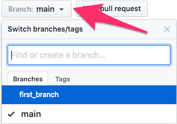

# Pull Request Workflow

Consider the following workflow for creating **pull requests**.

## Review & Merge

* First, create a repository, and add any collaborators via the **Settings** menu.

* On your local machines, create and work on local branches.

* When you're satisfied with the changes that you've made to your local branch and you want to merge it into `main`, **push the branch to GitHub**.

  * Specifically, run `git push origin <branch_name>`.

* Navigate to your GitHub repository in the browser, and select your branch from the dropdown on the homepage, as captured in the following image:

  

* Find and click the dropdown labeled **contribute** above the file list.

* Click the “Open pull request” button, which will open a new page for the pull request.

* When creating pull requests for your projects, you will want to add comments in the text box to track changes made.

* Click the "Create a pull request" button to create a pull request for this branch.

* Make sure to discuss who is responsible for reviewing PRs, and when.

- - -

© 2022 edX Boot Camps LLC. Confidential and Proprietary. All Rights Reserved.
