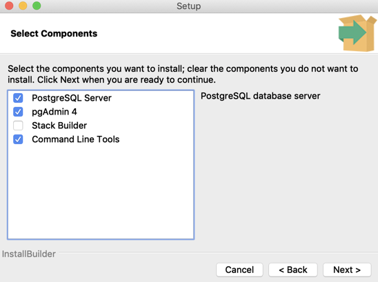

# Installing pgAdmin and Postgres on a Mac

Similar to coding with Python using Visual Studio Code, SQL requires a code editor with the ability to execute the scripts that are created by developers. This section guides you through the process of installing pgAdmin and Postgres on a Mac.

## Before You Begin

* Remember to choose the installation package specific to your operating system and download the latest version.

* Be prepared to record a password—it will be needed later!

## Download Link

* [PostgreSQL](https://www.enterprisedb.com/downloads/postgres-postgresql-downloads)

## Instructions

* After downloading PostgreSQL 14.7, double click on the `postgresql-14.7-1-osx.dmg` file. **Note:** The exact file version may be slightly different.

  

* Go through the Setup Wizard and install PostgreSQL. Keep the default location `/Library/PostgreSQL/14`.

* Select the components to be installed. Be sure to un-check `Stack Builder`.

  

* Add your data directory. Keep the default location `/Library/PostgreSQL/14/data`.

* Enter `postgres` as the password. **Be sure to record this password for future use.**

* Keep the default port as `5432`. In  the Advanced Options, set the locale as `[Default locale]`.

* The final screen will be the `Pre Installation Summary`.

* When you are done, you should have a folder in your `Applications` with these files.

  

* **Important:** if you are running the Big Sur update for Mac you will need to download the latest version of pgAdmin.

  * Go to the [pgAdmin download](https://www.pgadmin.org/download/pgadmin-4-macos/) and select the latest version.

  * Click the `.dmg` files to start the download.

    

  * Once the download is complete, click on the `.dmg` file in your downloads to install.

  * After it has finished installing, drag the `pgAdmin` file into your applications folder. (This will take a few minutes.)

  * Once the transfer completes, you will be able to use pgAdmin. **Note:** You will still have a version in your PostgreSQL folder, but only use the version that you copied into `Applications`.

* To confirm the installation, start `pgAdmin` (it will open in a new browser window). Connect to the default server by clicking on it and entering the password if prompted.

- - -

© 2022 edX Boot Camps LLC. Confidential and Proprietary. All Rights Reserved.
