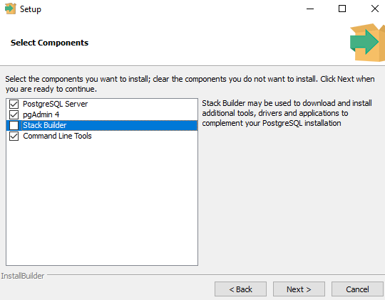

# Installing pgAdmin and Postgres on Windows

Similar to coding with Python using Visual Studio Code, SQL requires a code editor with the ability to execute the scripts that are created by developers. This section guides you through the process of installing pgAdmin and Postgres on a Mac.

## Before You Begin

* Remember to choose the installation package specific to your operating system and download the latest version.

* Be prepared to record a password—it will be needed later!

## Download Links

* [PostgreSQL](https://www.enterprisedb.com/downloads/postgresql)

* [Installation Instructions](https://www.enterprisedb.com/docs/supported-open-source/postgresql/installer/02_installing_postgresql_with_the_graphical_installation_wizard/windows/)

## Instructions

**Note:** You will be prompted to create a free account prior to downloading the software.

Follow these steps:

* After downloading the latest version of PostgreSQL 14.7, double-click the `postgresql-14.7-2-windows-x64.exe` file.

* **Note:** The exact file version may be slightly different.

* Go through the Setup Wizard and install PostgreSQL. Keep the default location `C:\Program Files\PostgreSQL\14`.

* Select the components to be installed. Uncheck the option to install Stack Builder.

  

* Add your data directory. Keep the default location `C:\Program Files\PostgreSQL\14\data`.

* Enter `postgres` as the password. **Be sure to record this password for future use.**

* Keep the default port as `5432`. In the Advanced Options, set the locale as  `[Default locale]`.

* The final screen will be the `Pre Installation Summary`.

* When you are done, the `Postgres 14` folder can be accessed from the Start menu of your computer.

  * This folder contains the `pgAdmin 4` application.

  * To confirm the installation, start `pgAdmin` (this will open in a new browser window). Connect to the default server by clicking on it and entering the password if prompted.

- - -

© 2022 edX Boot Camps LLC. Confidential and Proprietary. All Rights Reserved.
