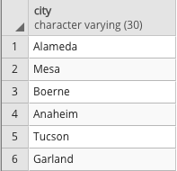

# Creating Tables

In this activity, you will use pgAdmin to recreate and query a table based on an image provided to you.

## Instructions

1. Create a new database in pgAdmin named `city_info`.

2. Using the query tool, create an empty table named `cities`. Be sure to match the data types!

3. Insert data into the new table. The result should match the following image.

    

    | city character varying (30) | state character varying (30) | population integer |
    |----|----|----|
    | Alameda | California | 79177 |
    | Mesa | Arizona | 496401 |
    | Boerne | Texas | 16056 |
    | Anaheim | California | 352497 |
    | Tucson | Arizona | 535677 |
    | Garland | Texas | 238002 |

4. Query the table to recreate the image below.

    

    | city character varying (30) |
    |----|
    | Alameda |
    | Mesa |
    | Boerne |
    | Anaheim |
    | Tucson |
    | Garland |

## Bonus

1. Filter the table to view only cities in Arizona.

2. Filter the table to view only cities with a population of less than 100,000.

3. Filter the table to view California cities with a population of less than 100,000.

## Hints

* For the second bonus question, you will need to use a [`WHERE` clause](https://www.tutorialspoint.com/sql/sql-where-clause.htm) to filter the original query.

* For the third bonus question, an [`AND` clause](https://www.tutorialspoint.com/sql/sql-and-or-clauses.htm) will also be necessary.

- - -

© 2022 edX Boot Camps LLC. Confidential and Proprietary. All Rights Reserved.
